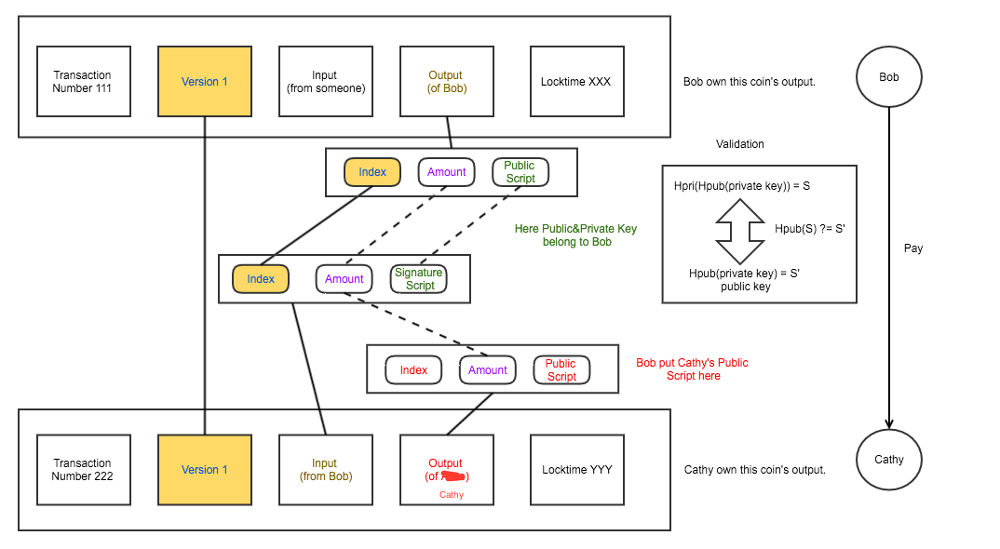

# Bitcoin

## 比特币支付系统

核心：去中心化(decentralized)，没有被任何公司和组织集中控制和操作

实现：区块链 (block chain)（模拟银行系统的核心“账本”），把账本发给所有人。具体来说，每个人都是一个节点，每个节点都有一份所有的交易记录，每次交易都被广播到所有节点

交易成功的条件
- 通过验证，是有效数据
- 得到绝大多数（51%）区块链网络的承认

其他要素
- 交流：点对点通信的广播(point to point connection)
- 加密：公私密钥 (public-private key)
- 防通胀：工作证明 (proof of work)，控制印钞的速度
- 挖矿：一种激励机制，得到的矿分为最初的那2100万比特币+手续费

## 比特币交易

比特币是虚拟物品，需要一个软件来进行操作，这个软件应该是开源的，可以看到源码，这样大家才能保证里面没有猫腻，危急信息安全，才能放心使用。
市面上也有许多类似的软件选择，比如：Electron，Bitcoin Knots，Copay等等。

**钱包**
- 这些不同的软件即钱包，可以用来安全地保存私钥，收发比特币，相当于银行。

**交易平台**
- 本来这已经够用了，但是为了钱生钱，又出现了交易平台，即把比特币作为一种商品进行买卖，用现实生活中的货币和比特币进行兑换，相当于交易所。

## 交易流程分析

原始阶段我们暂不讨论，考虑区块链已经发展到一定阶段的时候，分为两种人，一种是挖矿的人，一种是交易的人。流程如下：

交易的人写了一个新的区块，发出广播。挖矿的人验证这个区块是有效的之后，开始尝试写入区块链，通过proof of work的验证之后，一个新的区块加到了区块链中，再次发出广播。所有人包括其它挖矿人接受到这个讯息之后，更新一下自己的区块链。

这里有个疑问：同样是挖矿的人，看到别人挖的快挖到了我没挖到白忙活了，我一怒之下不接受他的更新，我只管自己埋头算，然后用我的区块来更新链可以吗？

区分两种情况：
- 第一，如果这只是个别现象，那没有用，区块链只认可大多数人都一致的那一条，你自己和别人不一样，那你的区块链版本只有一份，别人的主流版本有千万份。说白了，你的那份就没用了。
- 第二，如果这是个群体现象，每个人都这么干，那就是说大家都不认可这个规则了，总还是有一条最主流的链，但是人心散了，整个比特币系统就崩塌了。

## 区块链实现

一个Block可以分为如下几个部分
- Transaction Number
- Version Id
- Input
- Output
- Locktime

其中最关键的是Input和Output，如果把一个Block理解成一张纸币
- Input表示这个Block是从哪里来的，它的上一任主人是谁，代表了多少钱
- Output表示这个Block到了哪里去，它的现任主任是谁，代表了多少钱

可以看出，一个Block代表了一整个交易所有的信息，即交易的时间，交易的双方，交易的数量。

我们知道，Block是由一堆数据组成的，每个人都可以随便写一个Block，但是写出来的Block不一定有效。要想写一个能用过Validation的Block，需要保证"钱的来源是有效的"，即Input是有效的。

怎样保证Input的有效性？需要保证这个Input有与之对应的Valid Output。

举例

~~~
Block A：已经被承认了
     Input A/Owner X     Output A/Owner Y

Block B：正在写的一个新区块
     Input B/Owner Y     Output B/Owner Z
~~~

Input B给出的信息是，Owner Y有一些比特币可以交易，不信你看Output A。如果去验证Output A，可以发现和Input B是可以通过某种算法Match的。于是Input B是成立的，于是就可以把这些钱转给Owner Z。

这里的算法是通过公钥和私钥做的一个签名。具体的做法是：

Output A用Y的私钥对一串字符M做了加密得到了M'，这个M只有Y知道，其它人都不知道，也猜不到。而在写Input B的时候，需要用到这个M，加上Y的公钥才可以得到M'完成验证，于是保证了只有Y才能写出有效的Input B。

而这个M怎么来的，是用Y的公钥对Y的私钥进行加密得到的。

## 区块链软件设计
（笔者猜测/分析）为了构建一个区块链交易系统，需要以下模块：
- 交易所
	- 前段网页展示
	- 后端交易后台，数据分析等
- 区块链部分（客户端）
	- 下载机制（类似BT DOWNLOAD）
		- 网络IO
		- 断点续传
		- 数据文件系统
	- 工作证明算法
	- 加密算法

## Links

- <https://www.zhihu.com/question/20876219>
- <https://bitcoin.org/en/developer-guide#block-chain-overview>
- <https://en.bitcoin.it/wiki/Protocol_documentation>
- <https://www.weusecoins.com/en/mining-guide>
- <http://perlalchemy.blogspot.com/2011/05/bitcoin-protocol-highlevel-explanation.html>
