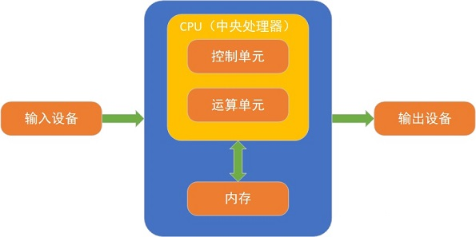
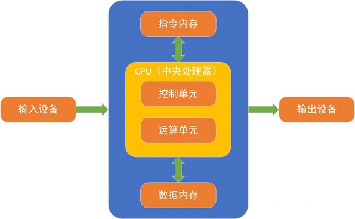
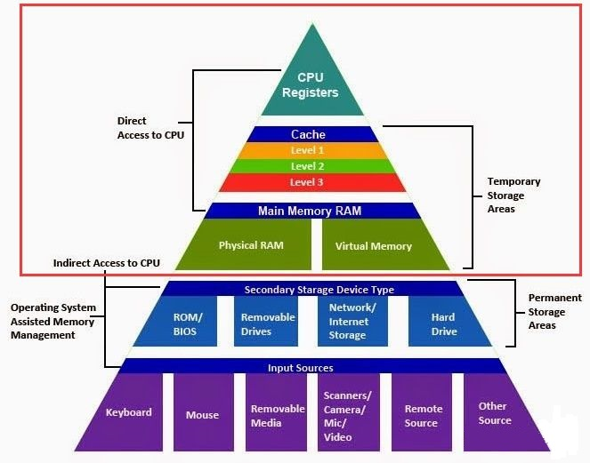
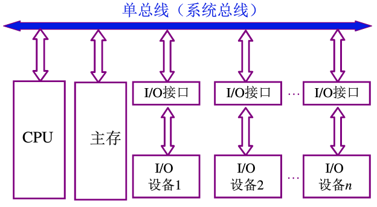
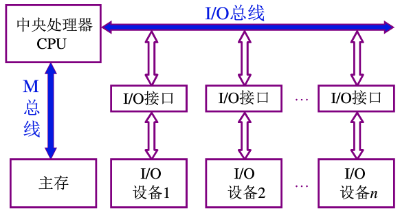

# Computer - Basic

## 计算机硬件架构

计算机构成，常见的有两种架构：
- 冯诺依曼架构
- 哈佛架构

### 冯诺依曼架构

简化如下：

~~~
输入 -> 计算（CPU + 内存） -> 输出
~~~

### 哈佛架构

和以上最大的不同点就是：内存分为独立的**指令内存**和**数据内存**。

~~~
输入 -> 计算（CPU + 指令内存 + 数据内存） -> 输出
~~~

这样的好处是：读写分开。将一部分静态的只读数据剥离出来。
这样，计算机读取指令，和读写数据两个过程，就可以分开 / 并行。

### 现代计算机架构

现代计算机架构是两种架构的混合体。某种程度上说，更像是改进的哈佛架构。

它在之前的基础上，还加入了缓存。

~~~
输入 -> 计算（CPU + 缓存 + 内存） -> 输出
~~~

其核心逻辑是牺牲速度，换取容量（反之亦然）。见下图，金字塔越往上，和CPU越近，交互速度越快，但是存储容量越小。

### 其它组成设备

输入设备：

- 键盘
- 鼠标
- 硬盘（数据可能来自硬盘）
- 网卡（数据可能来自网络）

输出设备：

- 显示器
- 打印机
- 硬盘（数据可能写回硬盘）
- 网卡（数据可能写回网络）

其它配件：

- 主板（把上面这些部件连接在一起）
- 电源
- 散热器
- 机箱

## 计算机系统总线结构

上面我们介绍了计算机的硬件组成，有一个问题：各个硬件之间是怎么连接起来的呢？这就用到了系统总线。

系统总线是把计算机中多个组件连接到一起的传输介质，负责设备间通信。

系统总线上传送的信息包括
- 数据信息
- 地址信息
- 控制信息

因此，系统总线**包含**有三种不同功能的总线
- 数据总线DB （Data Bus）
- 地址总线AB （Address Bus）
- 控制总线CB （Control Bus）

### 单总线结构

比较早的设计，只有一条总线，所有设备的通信都要通过这一条线。
同时只能有两个设备进行通信，其他设备间想要通信就必须等待。

这样有一个问题：比如一个I/O操作需要做1秒，而一个内存读写操作只要0.00001秒，让后者等前者，等得“花儿都谢了”。

### 双总线结构

分为两条线，一条I/O总线，一条内存总线。即可以一边I/O，一边读写内存，并行操作。

### 多总线结构

除此之外，还有三总线结构，四总线结构。

核心思想和双总线结构一样，**给不同速度的设备开辟不同的通道**，增加并行操作。

比如，普通I/O设备要和主存通信，需要经过CPU，通过两条总线。
现在有了一个高速I/O设备，它也走这个流程就可能被堵塞。
于是，开辟一条新的DMA(直接存储访问)总线，将高速I/O设备和主存连接起来，进行通信。

就好像高速公路多开几条车道一样，慢车走慢车道，快车走快车道，这样快车就不会被堵在慢车后面了。

## 参考

- 电脑硬件入门 <https://zhuanlan.zhihu.com/p/63322067>
- 计算机系统总线结构 <https://blog.csdn.net/qq_27347991/article/details/100629281>
