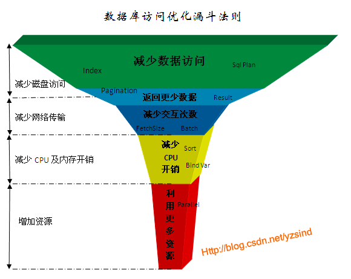

# DB - Tuning

## Goals for SQL Tuning

- Reduce the Workload
  - If a user is looking at the first twenty rows of the 10,000 rows returned in a specific sort order, and if the query (and sort order) can be satisfied by an index, then the user does not need to access and sort the 10,000 rows to see the first 20 rows.
- Balance the Workload
  - Systems often tend to have peak usage in the daytime when real users are connected to the system, and low usage in the nighttime. If noncritical reports and batch jobs can be scheduled to run in the nighttime and their concurrency during day time reduced, then it frees up resources for the more critical programs in the day.
- Parallelize the Workload

## 数据库优化的基本层次

- 减少数据库访问
  - 使用/优化缓存
  - 优化业务逻辑
- 减少数据访问
  - 只返回需要的字段
  - 数据分页展示
- 减少网络传输
  - update: batch update
  - select: increase fetch size
- 减少CPU开销 / 加速运算
  - 使用索引 index
  - 使用分区 partition
  - 使用绑定变量 Preparestatement（重复利用执行计划）
  - 合理使用排序
  - 减少比较操作或者模糊查询
- 利用更多资源
  - 客户端多线程并行访问 + threads
  - 数据库并行处理 select parallel

<http://www.cnblogs.com/easypass/archive/2010/12/08/1900127.html>

## Example - Format SQL Statements

- Formatting SQL statements for readability
- The order of tables in the FROM clause
- The placement of the most restrictive conditions in the WHERE clause
- The placement of join conditions in the WHERE clause

~~~ sql
FROM TABLE1,                              Smallest Table
     TABLE2,                              to
     TABLE3                               Largest Table, also BASE TABLE
WHERE TABLE1.COLUMN = TABLE3.COLUMN       Join condition
  AND TABLE2.COLUMN = TABLE3.COLUMN       Join condition
[ AND CONDITION1 ]                        Least restrictive
[ AND CONDITION2 ]                        Most restrictive
~~~

<http://www.informit.com/library/content.aspx?b=STY_Sql_24hours&seqNum=136>

## Example - Combine Multiples Scans with CASE Statements

Often, it is necessary to calculate different aggregates on various sets of tables. Usually, this is done with multiple scans on the table, but it is easy to calculate all the aggregates with one single scan. Eliminating n-1 scans can greatly improve performance.

Bad example
~~~ sql
SELECT COUNT (*)
  FROM employees
  WHERE salary < 2000;

SELECT COUNT (*)
  FROM employees
  WHERE salary BETWEEN 2000 AND 4000;

SELECT COUNT (*)
  FROM employees
  WHERE salary>4000;
~~~

->

Good example
~~~ sql
SELECT COUNT (CASE WHEN salary < 2000
                   THEN 1 ELSE null END) count1,
       COUNT (CASE WHEN salary BETWEEN 2001 AND 4000
                   THEN 1 ELSE null END) count2,
       COUNT (CASE WHEN salary > 4000
                   THEN 1 ELSE null END) count3
  FROM employees;
~~~

<http://docs.oracle.com/cd/B19306_01/server.102/b14211/sql_1016.htm#i35699>
