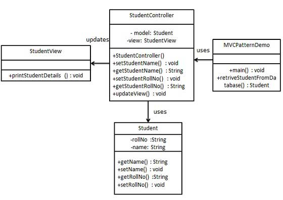
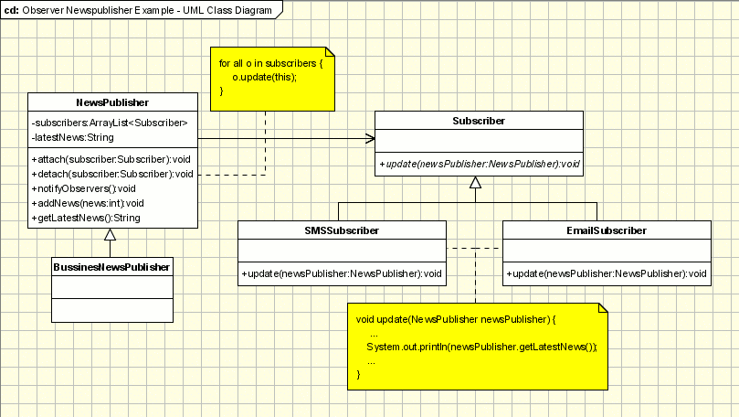

# Design Pattern - Basic

- Singleton Pattern
- MVC Pattern
- Tempalte Method Pattern
- Decorator Pattern
- Factory Pattern
- Observer Pattern
- [[proxy-pattern]]

## Singleton Pattern

Eager: crate instance when the class is loaded

~~~ java
public class Singleton {
    private Singleton() {}
    private static final Singleton INSTANCE = new Singleton();
    public static Singleton getInstance() {
        return INSTANCE;
    }
}
~~~

Lazy: crate instance only when its needed

~~~ java
public class SingletonDemo {
    private SingletonDemo() {}
	  private static SingletonDemo instance = null;
    public static synchronized SingletonDemo getInstance() {
        if (instance == null) {
            instance = new SingletonDemo();
        }
        return instance;
    }
}
~~~

## MVC Pattern

- Model: an object representing data or even activity
- View: some form of visualization of the state of the model
- Controller: offers facilities to change the state of the model

- <http://www.tutorialspoint.com/design_pattern/mvc_pattern.htm>

## Template Method Pattern

It defines the program skeleton of an algorithm in a method, called template method, which defers some steps to subclasses.

~~~ java
public class Coffee {
  public final void cookCoffee() {
    stepA();
    stepB();
    stepC();
  }
  public abstract void stepA();
  public abstract void stepB();
  public abstract void stepC();
}

public class CabuchinoCoffee extends Coffee() {
  public void stepA() {...}
  public void stepB() {...}
  public void stepC() {...}
}
~~~

实际用法实例：在父类中把"非功能性"代码写好，留下一个"口子"让子类去实现，子类只需要关注业务逻辑即可。

~~~ java
public abstract class BaseCommand {
  public void execute() {
    Logger logger = Logger.getLog(...);
    logger.debug(...);
    Utils.startTimer(...); 
    
    beginTxn();
    doBusiness(); // need to override
    commitTxn();

    Utils.endTimer(...);
    logger.debug(...);
  }
}

class PlaceOrderCommand extends BaseCommand {
  public void doBusiness() {
    // implementation
  }
}

class PaymentCommand extends BaseCommand {
  public void doBusiness() {
    // implementation
  }
}
~~~

-- 参考：《码农翻身》第二章/Spring的本质/设计模式：模板方法

## Decorator Pattern

> "在不必改变原类文件和使用继承的情况下，动态地扩展一个对象的功能。它是通过创建一个包装对象，也就是装饰来包裹真实的对象。"
> -- 百度百科

- ConcreteComponent:需要扩展的类
- Component:需要扩展功能的接口
- Decorator:装饰类
- ConcreteDecorator:装饰类的实现

在以下示例中，为了扩展ConcretComponent的doSomething功能，比如在其调用前后做一些操作，我们创建了一个Decorator和ConcreteDecorator。

~~~ java

public class ConcretComponent implements Component {
  public void doSomething() {
    System.out.println("Do it!");
  }
}

public interface Component {
  public void doSomething();
}

public class Decorator implements Component {
  public Component component;
  public Decorator(Component component) {
    this.component = component;
  }
  public void doSomething() {   
    this.component.doSomething();
  }
}

public class ConcreteDecorator extends Decorator {
  public ConcreteDecorator(Component component) {
    super(component);
  }

  public void doSomething() {
    System.out.println("Before Do it!");
    this.component.doSomething();
    System.out.println("After Do it!");
  }
}

// Use
Component component = new ConcreteDecorator(new ConcretComponent());
component.doSomething();

// Print
Before Do it!
Do it!
After Do it!
~~~

- [装饰器模式(Decorator)——深入理解与实战应用](https://www.cnblogs.com/jzb-blog/p/6717349.html)
- 参考：《码农翻身》第二章/Spring的本质/设计模式：装饰者

## Factory Pattern

- create object without exposing the creation logic to the client
- use a factory to create the object

~~~ java
public class ShapeFactory {
    public Shape getShape(String shapeType) {
       if (shapeType == null) {
           return null;
       }
       if (shapeType.equalsIgnoreCase("CIRCLE")) {
           return new Circle();
       } else if (shapeType.equalsIgnoreCase("RECTANGLE")) {
           return new Rectangle();
       }
       return null;
    }
}

public class FactoryPatternDemo {
    public static void main(String[] args) {
		    ShapeFactory shapeFactory = new ShapeFactory();
        Shape shape1 = shapeFactory.getShape("CIRCLE");
		    shape1.draw();
    }
}
~~~

- <http://www.tutorialspoint.com/design_pattern/factory_pattern.htm>

## Observer Pattern

- When to use: Whenever a subject has to be observed by one or more observers.
- Intent: Defines a one-to-many dependency between objects so that when one object changes state, 
all its dependents are notified and updated automatically.

- `Subject` holds `State` and `List of Observers`.
- When `State` changes, `Subject` will notify `Observer`.
- And then `Observer` can update the change to end user.

