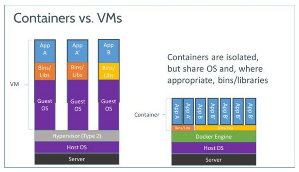

# Docker

## 什么是Docker

> Docker可以让开发者打包他们的应用(app)以及依赖包(dependency)到一个轻量级、可移植的容器中，然后发布到任何流行的Linux机器上。

更直白的说，Docker是**环境**。Docker不是虚拟机，Docker实际上只做了一件事情 - 镜像管理。负责将可执行的镜像导入导出，在不同设备上迁移。

## Docker的原理

Docker是基于LXC(Linux Container)技术之上构建的**应用容器引擎**。

- 虚拟机，需要模拟整台机器的所有硬件，有自己的操作系统（GuestOS）。
- 容器，是运行在母操作系统（HostOS）上的，有独立的二进制，库，和应用。

## Docker的优点

- 小：启动快，轻量，需要资源少。
- 简化配置，同样的配置可以在不同环境下使用（不同的硬件设施，不同的平台 ）
  - 解决的问题是复杂的环境管理，为了成功发布一款产品，往往需要配置各种OS，中间件等。
- 代码流水线管理，开发环境和生产环境保持一致
- 快速搭建环境
  - 一个新的开发人员进组，一般来说需要在自己的电脑上撘环境，很复杂也很耗时间。如果用了Docker之后，只需要在自己的电脑上装Docker，然后pull小组的image，直接就可以跑起来。
  - 一般来说，开发环境是要领先生产环境的，如果生产环境出了BUG怎么修？肯定不能把生产环境停了做调试。一般是做个一模一样的数据库和服务器的copy，然后在这个copy上调试。这时，又要重新搭建一遍环境。
- 隔离应用

## Docker的应用场景

- Web应用的自动化打包和发布
- 自动化测试和持续集成、发布
- 在服务型环境中部署和调整数据库或其他的后台应用
- 从头编译或者扩展现有的OpenShift或Cloud Foundry平台来搭建自己的PaaS环境

## Links

- <https://docker-curriculum.com/>
- <https://yq.aliyun.com/articles/6894?spm=5176.100239.blogcont40494.22.kLOqEG>
- <https://github.com/shell909090/slides/blob/master/md/docker.md>
- <http://www.infoq.com/cn/articles/docker-core-technology-preview>
