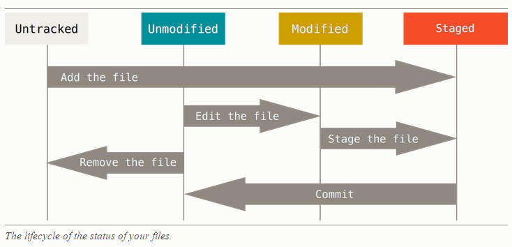

# Git

## Types of Verson Control System

- **Local** Version Control System
- **Centralized** Version Control System
- **Distributed** Version Control System

## General Steps of Version Control

- Check-out (pull)
- Adding file (add)
- Commit (commit)
- Check-in (push)
- Diff (merge)

## Git v.s. Others

Git store snapshots, not differences

## Three stages

- working directory
- staging area
- repository


## Life Cycle of File in the Working Directory

- in the beginning of check out, everything is **unmodified**
- then you edit the file, the file becomes **modified**
- then you stage the file, the file becomes **staged**
- finally you commit the file, the file becomes **unmodified**
- or you can remove the file, then the file becomes **untracked**



## Git Command

```
.gitignore
git init
git clone
git add
git commit
git commit --amend; undo things
git status
git diff; see what you’ve changed but not yet staged
git diff --staged; see what you’ve staged that will go into your next commit
git rm
git mv file_from file_to
git log
git remote -v
git remote add [shortname] [url]
git fetch [remote-name]
git push [remote-name] [branch-name]
```

### upload new created project from local

```
git init
git config --local user.name <"myname">
git config --local user.email <"myname@email.com">
git remote add <origin> <https://my.repo.git>
git remote -v
git pull <origin> <master>
git push <origin> <master>
```

### git fetch vs pull

`git pull` = `git fetch` + `git merge`

### git rebase vs merge

- `git merge` is "non-destructive", "the existing branches are not changed in any way".
- `git rebase` "re-writes the project history by creating brand new commits for each commit in the original branch".

### git stash

"Stashing takes the dirty state of your working directory — that is, your modified tracked files and staged changes — and saves it on a stack of unfinished changes that you can reapply at any time."

- https://git-scm.com/book/en/v1/Git-Tools-Stashing
- http://stackoverflow.com/questions/23898093/stash-the-changes-made-with-atlassian-sourcetree

### git revert

- `git revert <commit hash>` create a new commit to revert the unwanted commit
- `git revert --no-commit <commit hash>` revert the unwanted commit and leave the changes in the staging area

### git reset

- `git reset <commit-id>` reset to the target commit

different mode:
- `--soft`: just reset HEAD (HEAD means where is the current commit)
- `--mixed`: reset HEAD and index (index means the tracking changed file)
- `--hard`: reset HEAD, index and working tree (working tree means the local changes)

## Git branching model

- <http://nvie.com/posts/a-successful-git-branching-model/>
- <http://nvie.com/files/Git-branching-model.pdf>

## Misc

### add and use ssh key

```
https://help.github.com/articles/about-ssh/

add
step1 : generate an SSH key and add it to the ssh-agent
step2 : add the key to your GitHub account

use
specify the ssh key to use for a given repo: git config core.sshCommand "ssh -i ~/.ssh/id_rsa"
```

### Save credential

If you’re using an HTTPS URL to push over, the Git server will ask you for your username and password for authentication. 
By default it will prompt you on the terminal for this information so the server can tell if you’re allowed to push.

If you don’t want to type it every single time you push, you can set up a “credential cache”. The simplest is just to keep it in memory for a few minutes, which you can easily set up by running `git config --global credential.helper cache`.
For more information on the various credential caching options available, see Credential Storage.

### Commit emoji for my system

- :heart: `:heart:` major commit
- :green_heart: `:green_heart:` minor commit

## Links
- <https://www.atlassian.com/git/tutorials/what-is-version-control>
- <https://git-scm.com/book/en/v2/Getting-Started-Git-Basics>
