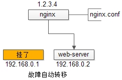
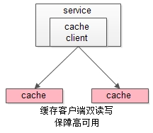
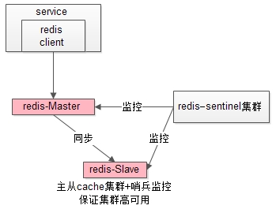
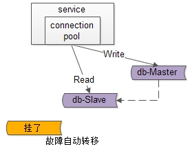
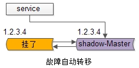

# High Availability

## 什么是 HA

高可用，即，通过设计**减少系统不能提供服务的时间**。

很多公司的高可用目标是4个9，也就是99.99%，这就意味着，系统的年停机时间为8.76个小时。

## 如何保障高可用

高可用保证的原则是“集群化”，或者叫**冗余**。只有一个单点，挂了服务会受影响；如果有冗余备份，挂了还有其他 backup 能够顶上。

有了冗余之后，还不够，每次出现故障需要人工介入恢复势必会增加系统的不可服务实践。所以，又往往是通过**自动故障转移**来实现系统的高可用。

## 实践

1.**Client**到**Reverse Proxy**的高可用，是通过反向代理层的冗余实现的，常见实践是keepalived + virtual IP自动故障转移。

2.**Reverse Proxy**到**Web Application**的高可用，是通过站点层的冗余实现的，常见实践是nginx与web-server之间的存活性探测与自动故障转移。

3.**Web Application**到**Service Layer**的高可用，是通过服务层的冗余实现的，常见实践是通过service-connection-pool来保证自动故障转移。

4.**Service Layer**到**Cache**的高可用，是通过缓存数据的冗余实现的，常见实践是缓存客户端双读双写，或者利用缓存集群的主从数据同步与sentinel保活与自动故障转移

5.**Service Layer**到**DB**“读”的高可用，是通过读库的冗余实现的，常见实践是通过db-connection-pool来保证自动故障转移。

6.**Service Layer**到**DB**“写”的高可用，是通过写库的冗余实现的，常见实践是keepalived + virtual IP自动故障转移。

## 参考

- <https://gitbook.cn/books/583c1335c7f2666319396f7f/index.html>
