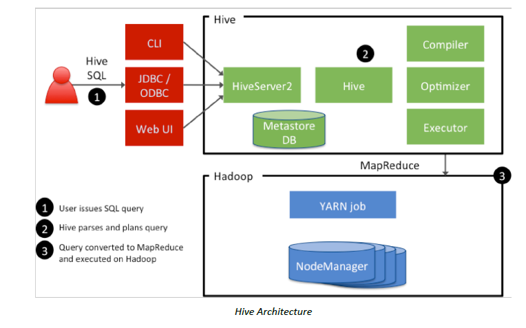
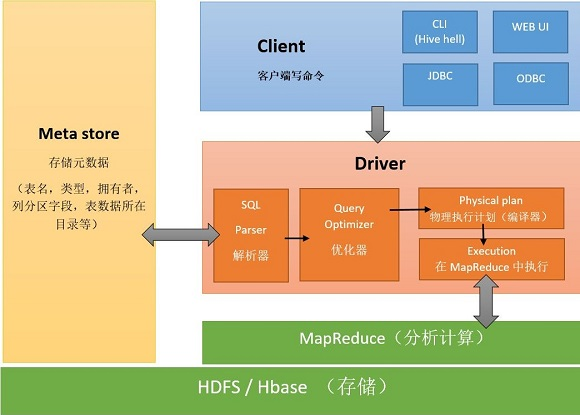
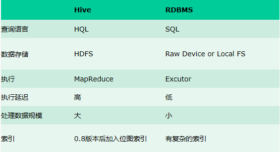

# Hive

-> Hadoop SQL Engine

## 概述

产生背景
- MapReduce编程不方便
- 传统RDBMS人员的需求，习惯使用SQL

定义
- 由Facebook开源，用于解决海量结构化日志的数据统计问题
- 构建在Hadoop之上的数据仓库
- 将结构化的数据文件映射为一张数据库表
- 提供了类SQL的查询语言: HQL
- 底层支持多种不同的执行引擎: MapRexuce/Spark/Tez

特点之一：统一元数据管理，方便切换 query 引擎，如 Hive，Spark SQL，impala...
- （实际）数据存放在HDFS
- 元数据信息（一般）存放在MySQL

## 架构

流程

- Client 发出 query
- Hive 进行 parse，最终转化为 MapReduce 作业
- 在 HDFS 上执行

模块

- Hive Client
  - CLI(shell)
  - Thrift
  - JDBC/ODBC driver
  - Web UI (HUE/Zeppelin)
- Hive Service
  - Server
  - Metastore
  - Driver
- Hadoop
  - Yarn
  - HDFS

## Hive v.s. RDBMS

Hive具有sql数据库外表，但应用场景完全不同，hive只适合用来做批量数据统计分析。

Hive数据导出到RDBMS：`sqoop` -> <https://sqoop.apache.org/>

## 存储格式

- Hive中所有的数据都存储在 HDFS 中，没有专门的数据存储格式
- 可支持`Text`, `SequenceFile`, `ParquetFile`, `RCFile`等
- 只需要在创建表的时候告诉 Hive 数据中的**分隔符**（行/列），Hive 就可以解析数据

## 数据模型

Hive 中包含以下数据模型：
- `DB` ：在hdfs中表现为${hive.metastore.warehouse.dir}目录下一个文件夹
- `Table` ：在hdfs中表现所属db目录下一个文件夹
- `External Table` ：与table类似，不过其数据存放位置可以在任意指定路径
- `Partition` ：在hdfs中表现为table目录下的子目录
- `Bucket` ：在hdfs中表现为同一个表目录下根据hash散列之后的多个文件

## 安装 MySQL

Hive的Metadata一般存在MySQL，所以需要先在服务器上安装好MySQL数据库。

参考 -> <https://github.com/chennanni/note-tech/blob/master/db/mysql/index.md>

## 部署 Hive

1.下载+解压：<http://archive.apache.org/dist/hive/>

（注：如果是CDH版本的，version应该保持一致；如果是apache版本的，version可能不一致，如`hadoop-2.7.2` 对应 `hive-2.3.6`）

2.添加`HIVE_HOME`到系统环境变量

~~~
export HIVE_HOME=$HOME/hive/apache-hive-2.3.6-bin
export PATH=$PATH:$HIVE_HOME/bin
~~~

3.修改配置

(create if not there) `/conf/hive-env.sh` 

~~~
export HADOOP_HOME=/root/hadoop/hadoop-2.7.1
~~~

(create if not there) `/conf/hive-site.xml` 

~~~ xml
<?xml version="1.0"?>
<?xml-stylesheet type="text/xsl" href="configuration.xsl"?>

<configuration>
	<property>
	  <name>javax.jdo.option.ConnectionURL</name>
	  <value>jdbc:mysql://hadoop000:3306/hadoop_hive?createDatabaseIfNotExist=true&amp;characterEncoding=UTF-8&amp;useSSL=false</value>
	</property>

	<property>
	  <name>javax.jdo.option.ConnectionDriverName</name>
	  <value>com.mysql.jdbc.Driver</value>
	</property>

	<property>
	  <name>javax.jdo.option.ConnectionUserName</name>
	  <value>root</value>
	</property>

	<property>
	  <name>javax.jdo.option.ConnectionPassword</name>
	  <value>123456</value>
	</property>
</configuration>
~~~

4.拷贝MySQL驱动包到 `$HIVE_HOME/lib`

下载地址： <https://dev.mysql.com/downloads/connector/j/8.0.html>

~~~
mysql-connector-java-5.1.48-bin.jar
~~~

## 使用 Hive

~~~
$ hive

> create database test_db;
> show databases;
~~~

语法和SQL非常类似。

### DDL

~~~
hive> DROP TABLE invites;
hive> CREATE TABLE invites (foo INT, bar STRING) ROW FORMAT DELIMITED FIELDS TERMINATED BY '\t';
hive> ALTER TABLE invites ADD COLUMNS (new_col2 INT COMMENT 'a comment');
hive> DESCRIBE FORMATTED invites;

CREATE (DATABASE|SCHEMA) [IF NOT EXISTS] database_name
  [COMMENT database_comment]
  [LOCATION hdfs_path]
  [WITH DBPROPERTIES (property_name=property_value, ...)];

CREATE [TEMPORARY] [EXTERNAL] TABLE [IF NOT EXISTS] [db_name.]table_name    -- (Note: TEMPORARY available in Hive 0.14.0 and later)
  [(col_name data_type [COMMENT col_comment], ... [constraint_specification])]
  [COMMENT table_comment]
  [PARTITIONED BY (col_name data_type [COMMENT col_comment], ...)]
  [CLUSTERED BY (col_name, col_name, ...) [SORTED BY (col_name [ASC|DESC], ...)] INTO num_buckets BUCKETS]
  [SKEWED BY (col_name, col_name, ...)                  -- (Note: Available in Hive 0.10.0 and later)]
     ON ((col_value, col_value, ...), (col_value, col_value, ...), ...)
     [STORED AS DIRECTORIES]
  [
   [ROW FORMAT row_format] 
   [STORED AS file_format]
     | STORED BY 'storage.handler.class.name' [WITH SERDEPROPERTIES (...)]  -- (Note: Available in Hive 0.6.0 and later)
  ]
  [LOCATION hdfs_path]
  [TBLPROPERTIES (property_name=property_value, ...)]   -- (Note: Available in Hive 0.6.0 and later)
  [AS select_statement];   -- (Note: Available in Hive 0.5.0 and later; not supported for external tables)
~~~

注：`/user/hive/warehouse`是Hive默认的存储在HDFS上的路径

### DML

- `LOCAL`：本地系统，如果没有local那么就是指的HDFS的路径
- `OVERWRITE`：是否数据覆盖，如果没有那么就是数据追加

~~~
# 导入数据
hive> LOAD DATA LOCAL INPATH './examples/files/invites_test.txt' OVERWRITE INTO TABLE invites;
hive> LOAD DATA INPATH '/user/file/emp_test.txt' OVERWRITE INTO TABLE emp;

LOAD DATA [LOCAL] INPATH 'filepath' [OVERWRITE] INTO TABLE tablename [PARTITION (partcol1=val1, partcol2=val2 ...)]
~~~

### Query

~~~
# 查询数据
select deptno, avg(sal) from emp group by deptno;

# 导出数据到文件
INSERT OVERWRITE LOCAL DIRECTORY '/tmp/hive/'
ROW FORMAT DELIMITED FIELDS TERMINATED BY '\t'
select * from emp;

# 查看执行计划
explain EXTENDED
select e.empno,e.ename,e.sal,e.deptno,d.dname
from emp e join dept d
on e.deptno=d.deptno;
~~~

参考 -> <https://cwiki.apache.org/confluence/display/HIVE#Home-UserDocumentation>

## 内部表 v.s. 外部表

**MANAGED_TABLE**:内部表；删除表：HDFS上的数据被删除 & Meta也被删除

（一般普通建表语句创建的就是内部表）

~~~
CREATE TABLE emp(
empno int,
ename string,
job string,
mgr int,
hiredate string,
sal double,
comm double,
deptno int
) ROW FORMAT DELIMITED FIELDS TERMINATED BY '\t';

LOAD DATA LOCAL INPATH '/home/hadoop/data/emp.txt' OVERWRITE INTO TABLE emp;
~~~

**EXTERNAL_TABLE**:外部表；HDFS上的数据不被删除 & Meta被删除

（建表时，需要加上`EXTERNAL`关键字，并指定数据存放位置）

~~~
CREATE EXTERNAL TABLE emp_external(
empno int,
ename string,
job string,
mgr int,
hiredate string,
sal double,
comm double,
deptno int
) ROW FORMAT DELIMITED FIELDS TERMINATED BY '\t'
location '/external/emp/';

LOAD DATA LOCAL INPATH '/home/hadoop/data/emp.txt' OVERWRITE INTO TABLE emp_external;
~~~

## 常见工作流程

- 在Hadoop上**定时**运行ETL作业（初步数据处理+清洗）
- 将ETL结果导入到Hive中进行分析
- 将各个维度的分析统计结果导入到指定表中
- 导出数据到文件/RDBMS

### 定时任务调度

crontab

-> <https://www.runoob.com/linux/linux-comm-crontab.html>

Azkaban

-> <https://azkaban.readthedocs.io/en/latest/>

## 参考

- Hive 安装-使用HDFS文件系统 <https://blog.csdn.net/qq_38038143/article/details/84432998>
- Hadoop之Hive详解 <https://www.cnblogs.com/atomicbomb/p/9904829.html>
- 文档 <https://cwiki.apache.org/confluence/display/HIVE>

