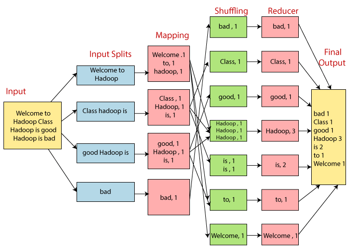

# Hadoop - MapReduce

## 概述

源于Google MapReduce论文，发表于2004年12月

Hadoop MapReduce是Google MapReduce的克隆版

优点：海量数据离线处理 & 易运行 & 易开发

缺点：实时流式计算

## 执行步骤

- Input 准备输入数据
- (Split)
- Mapper 处理
- Shuffle
- Reduce 处理
- Output 结果输出

## 编程核心概念

~~~
InputFormat
(Split)
(RecordReaders)
(Paritioner)
(Combiner)
OutputFormat
~~~

## 实战

Mapper

~~~ java
import org.apache.hadoop.io.IntWritable;
import org.apache.hadoop.io.LongWritable;
import org.apache.hadoop.io.Text;
import org.apache.hadoop.mapreduce.Mapper;

import java.io.IOException;

/**
 * KEYIN: Map任务读数据的key类型，offset，是每行数据起始位置的偏移量  Long, e.g. 0
 * VALUEIN:Map任务读数据的value类型，其实就是一行行的字符串  String, e.g. hello world welcome
 *
 * hello world welcome
 * hello welcome
 *
 * KEYOUT: map方法自定义实现输出的key的类型  String, e.g. hello
 * VALUEOUT: map方法自定义实现输出的value的类型  Integer, e.g. 2
 *
 * 词频统计：相同单词的次数   (word,1)
 *
 * Long,String,Integer 是 Java 里面的数据类型
 * LongWritable,Text 是 Hadoop 自定义类型，好处是能快速序列化和反序列化
 *
 */
public class WordCountMapper extends Mapper<LongWritable,Text,Text,IntWritable>{

    /**
     * @param key: offset, e.g. 0
     * @param value: String, e.g. hello world welcome
     * @param context
     * @throws IOException
     * @throws InterruptedException
     */
    @Override
    protected void map(LongWritable key, Text value, Context context) throws IOException, InterruptedException {
        // 把value对应的行数据按照指定的分隔符拆开
        String[] words = value.toString().split("\t");
        for(String word : words) {
            // (hello,1)  (world,1)
            context.write(new Text(word.toLowerCase()), new IntWritable(1));
        }
    }
}
~~~

Reducer

~~~ java
import org.apache.hadoop.io.IntWritable;
import org.apache.hadoop.io.Text;
import org.apache.hadoop.mapreduce.Reducer;

import java.io.IOException;
import java.util.Iterator;

/**
 * INPUT
 * (hello,1)  (world,1)
 * (hello,1)  (world,1)
 * (hello,1)  (world,1)
 * (welcome,1)
 *
 * map的输出到reduce端，是按照相同的key分发到一个reduce上去执行
 *
 * reduce1: (hello,1)(hello,1)(hello,1)  ==> (hello, <1,1,1>)
 * reduce2: (world,1)(world,1)(world,1)  ==> (world, <1,1,1>)
 * reduce3: (welcome,1)                  ==> (welcome, <1>)
 */
public class WordCountReducer extends Reducer<Text,IntWritable, Text,IntWritable>{

    /**
     * @param key: e.g. hello
     * @param values: e.g. <1,1,1>
     * @param context
     * @throws IOException
     * @throws InterruptedException
     */
    @Override
    protected void reduce(Text key, Iterable<IntWritable> values, Context context) throws IOException, InterruptedException {
        int count = 0;
        Iterator<IntWritable> iterator = values.iterator();
        while (iterator.hasNext()) {
            IntWritable value = iterator.next();
            count += value.get();
        }
        context.write(key, new IntWritable(count));
    }
}
~~~

App

~~~ java
import org.apache.hadoop.conf.Configuration;
import org.apache.hadoop.fs.FileSystem;
import org.apache.hadoop.fs.Path;
import org.apache.hadoop.io.IntWritable;
import org.apache.hadoop.io.Text;
import org.apache.hadoop.mapreduce.Job;
import org.apache.hadoop.mapreduce.lib.input.FileInputFormat;
import org.apache.hadoop.mapreduce.lib.output.FileOutputFormat;

import java.net.URI;

/**
 *
 * 使用MR统计HDFS上的文件对应的词频
 *
 * Driver: 配置Mapper，Reducer的相关属性
 *
 */
public class WordCountApp {

    public static final String HDFS_PATH = "hdfs://0.0.0.0:8020";

    public static void main(String[] args) throws Exception{

        System.setProperty("HADOOP_USER_NAME", "hadoop");

        Configuration configuration = new Configuration();
        configuration.set("fs.defaultFS",HDFS_PATH);

        // 创建一个Job
        Job job = Job.getInstance(configuration);

        // 设置Job对应的参数: 主类
        job.setJarByClass(WordCountApp.class);

        // 设置Job对应的参数: 设置自定义的Mapper和Reducer处理类
        job.setMapperClass(WordCountMapper.class);
        job.setReducerClass(WordCountReducer.class);

        // 设置Job对应的参数: Mapper输出key和value的类型
        job.setMapOutputKeyClass(Text.class);
        job.setMapOutputValueClass(IntWritable.class);

        // 设置Job对应的参数: Reduce输出key和value的类型
        job.setOutputKeyClass(Text.class);
        job.setOutputValueClass(IntWritable.class);

        // 如果输出目录已经存在，则先删除
        FileSystem fileSystem = FileSystem.get(new URI(HDFS_PATH),configuration, "hadoop");
        Path outputPath = new Path("/wordcount/output");
        if(fileSystem.exists(outputPath)) {
            fileSystem.delete(outputPath,true);
        }

        // 设置Job对应的参数: Mapper输出key和value的类型：作业输入和输出的路径
        FileInputFormat.setInputPaths(job, new Path("/wordcount/input"));
        FileOutputFormat.setOutputPath(job, outputPath);

        // 提交job
        boolean result = job.waitForCompletion(true);

        System.exit(result ? 0 : -1);

    }
}
~~~
