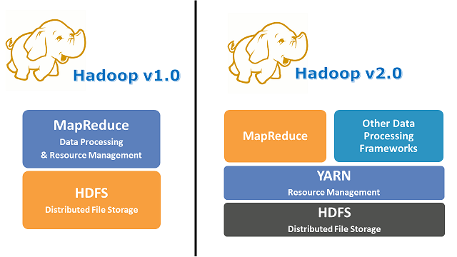

# Hadoop - Yarn

## 起源

Apache Yarn - Yet Another Resource Negotiator

Hadoop Map Reduce 1 还不是很成熟，有各种各样的问题。

Hadoop Map Reduce 2 这个版本引出了Yarn。

它的核心思想是：统一管理整个集群的资源调度，从而提高资源利用率。

此外，还有以下特点：
- 支持其它计算框架，比如Spark
- 扩展性好，可以弹性伸缩
- 支持高可用

## 架构

总体上是 master / slave 结构，在整个资源管理框架中， ResourceManager 为 master， NodeManager 是 slave。

- ResourceManager
- NodeManager
- ApplicationMaster
- Container

## ResourceManager

RM是一个全局的资源管理器，集群只有一个，负责整个系统（所有节点）的资源管理和监控。
- 处理 Client 请求
- 启动/监控 ApplicationMaster
- 监控 NodeManager
- 资源调度

它主要由两个组件构成：调度器 Scheduler 和应用程序管理器 Applications Manager, ASM 。

Scheduler
- FIFO Scheduler：先进先出，不考虑作业优先级和范围，适合低负载集群
- Capacity Scheduler：将资源分为多个队列，允许共享集群，有保证每个队列最小资源的使用
- Fair Scheduler：公平的将资源分给应用的方式，使得所有应用在平均情况下随着时间得到相同的资源份额

ApplicationManager
- 主要负责接收job的提交请求，为应用分配第一个Container来运行ApplicationMaster
- 还有就是负责监控ApplicationMaster，在遇到失败时重启ApplicationMaster运行的Container

## ApplicationMaster

相当于这个Application的监护人和管理者。负责监控、管理这个Application的在集群上的运行。一个Application对应一个ApplicationMaster。

## NodeManager

管理这个 Node 节点的资源分配和监控运行情况。

## Container

Container 是 YARN 中的**资源抽象**。

它封装了某个节点上的多维度资源，如内存、CPU、磁盘、网络等。当 AM 向 RM 申请资源时，RM 为 AM 返回的资源便是用 Container 表示的。
YARN 会为每个任务分配一个 Container，且该任务只能使用该 Container 中描述的资源。

## 流程

1. 客户端程序向 ResourceManager 提交应用并请求一个 ApplicationMaster 实例；
2. ResourceManager 找到一个可以运行一个 Container 的 NodeManager，并在这个 Container 中启动 ApplicationMaster 实例；
3. ApplicationMaster 向 ResourceManager 进行注册，注册之后客户端就可以查询 ResourceManager 获得自己 ApplicationMaster 的详细信息，以后就可以和自己的 ApplicationMaster 直接交互了（这个时候，客户端主动和 ApplicationMaster 交流，应用先向 ApplicationMaster 发送一个满足自己需求的资源请求）；
4. 在平常的操作过程中，ApplicationMaster 根据 resource-request协议 向 ResourceManager 发送 resource-request请求；
5. 当 Container 被成功分配后，ApplicationMaster 通过向 NodeManager 发送 container-launch-specification信息 来启动Container，container-launch-specification信息包含了能够让Container 和 ApplicationMaster 交流所需要的资料；
6. 应用程序的代码以 task 形式在启动的 Container 中运行，并把运行的进度、状态等信息通过 application-specific协议 发送给ApplicationMaster；
7. 在应用程序运行期间，提交应用的客户端主动和 ApplicationMaster 交流获得应用的运行状态、进度更新等信息，交流协议也是 application-specific协议；
8. 一旦应用程序执行完成并且所有相关工作也已经完成，ApplicationMaster 向 ResourceManager 取消注册然后关闭，用到所有的 Container 也归还给系统。

## 实战

### 配置

`etc/hadoop/mapred-site.xml`

~~~ xml
<configuration>
    <property>
        <name>mapreduce.framework.name</name>
        <value>yarn</value>
    </property>
</configuration>
~~~

`etc/hadoop/yarn-site.xml`

~~~ xml
<configuration>
    <property>
        <name>yarn.nodemanager.aux-services</name>
        <value>mapreduce_shuffle</value>
    </property>
</configuration>
~~~

### 启停

ResourceManager + NodeManager

~~~
sbin/start-yarn.sh
sbin/stop-yarn.sh
~~~

### 提交作业

~~~
hadoop jar example.jar wordccount /input/hello.txt /output/helloCount.txt
~~~

## 参考

- 文档 <https://hadoop.apache.org/docs/current/hadoop-yarn/hadoop-yarn-site/YARN.html>
- YARN 详细解析 <https://www.jianshu.com/p/f50e85bdb9ce>
