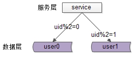

# High Concurrency

## 什么是 HC

高并发，即，通过设计保证**系统能够同时并行处理很多请求**。

## 如何实现高并发

- 垂直扩展（Scale Up）
  - 通过提升单机硬件性能，或者提升单机架构性能，来提高并发性，但单机性能总是有极限的
- 水平扩展（Scale Out）
  - 增加服务器数量，线性扩充系统性能，需要系统架构支持水平扩展

## 实践

1. Reverse Proxy Layer可以通过“DNS轮询”的方式来进行水平扩展。

2. Web Application Layer可以通过nginx来进行水平扩展；

3. Service Layer 可以通过服务连接池来进行水平扩展；

4. DB Layer 可以按照数据范围，或者数据哈希的方式来进行水平扩展。

## 参考

- <https://gitbook.cn/books/58612264a1b142f653e24cb4/index.html>
