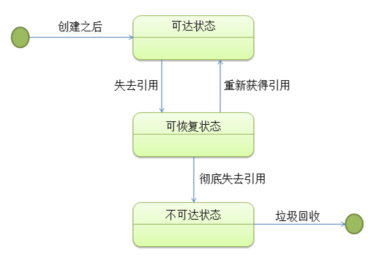

# Java - GC

## 什么是GC

Garbage Collection，垃圾回收，就是通过某些算法，将不再使用，不需要的内存空间释放。

主要分为几个步骤：
- 找到需要回收的对象
- 进行回收
- 碎片整理（可选）

在C语言中，GC是需要程序员手动进行的，十分繁琐。而在Java，Python等语言中，GC是由程序自动执行的，减轻了程序员的负担。

## 为什么要做GC

- 获得更多空闲的内存
- 可以有效的防止因内存泄露（指该内存空间使用完毕后未回收）而导致的一系列问题

## 什么是Garbage

在Java中，如果一个（或者一群）对象没有其它的对象引用到它（们），就是垃圾。

## 怎么找到Garbage

- Reference Count:引用计数
  - 对于某个对象，计算它被其它对象引用到的次数。
  - 但是，RC没有办法处理循环引用的情况。例：`A<->B`，A,B只被对方互相引用到，而没有其它引用，其实也可以算作Garbage。
- Root Searching: 根可达算法
  - 以根对象为起点，逐一标记其引用到的对象，如果某些对象没有被标记到，就是Garbage。

## 根可达算法进阶

程序运行后，它在内存中的状态可以看成是有向图，分为三种：
- 可达状态：在一个对象创建后，有一个以上的引用变量引用它。在有向图中可以从起始顶点导航到该对象，那它就处于可达状态。
- 可恢复状态：如果程序中某个对象不再有任何的引用变量引用它，它将先进入可恢复状态，此时从有向图的起始顶点不能再导航到该对象。在这个状态下，系统的垃圾回收机制准备回收该对象的所占用的内存，在回收之前，系统会调用`finalize()`方法进行资源清理，如果资源整理后重新让一个以上引用变量引用该对象，则这个对象会再次变为可达状态；否则就会进入不可达状态。
- 不可达状态：当对象的所有关联都被切断，且系统调用`finalize()`方法进行资源清理后依旧没有使该对象变为可达状态，则这个对象将永久性失去引用并且变成不可达状态，系统才会真正的去回收该对象所占用的资源。

## GC的三种算法

- mark-sweep 标记-清除
- mark-sweep-compact 标记-清除-压缩
- copy 复制

## GC的两种策略

- 串行
- 并行

## 具体怎么做GC（算法+策略的组合应用）

首先，关于一个概念：应用程序停止，stop-the-world：除了GC所需的线程以外，所有线程都处于等待状态，直到GC完成。它会发生在任何一个GC算法中，不同的算法，不同的优化策略，一定程度上就是减少系统等待时间。

按代回收的机制，不同的代的回收算法不同
- 新生代 Young Generation，对应minor GC
  - Elden*1
  - Survivor*2
- 老年代 Old Generation，对应major GC
- 持久代 Permanent Generation，对应major GC

不同的GC类型（策略+算法）
- 串行回收 Serial GC
- 并行回收 Parallel GC
- Parallel Old GC
- CMS, Concurrent Mark & Sweep GC
- G1, Garbage First

## 可能发生内存泄露的情况

即使有了GC机制，还是可能发生内存泄露问题，如下：
- 静态集合类像HashMap，Vector等的使用，即使其元素被赋值为null，还是不会被GC。
- 数据库连接，网络连接，IO连接等没有显示调用close关闭。
- 监听器的使用，在释放对象的同时没有相应删除监听器。

## Links
- <http://www.importnew.com/15330.html>
- <http://www.importnew.com/1993.html>
- <http://www.cnblogs.com/andy-zcx/p/5522836.html>
- <http://www.oracle.com/webfolder/technetwork/tutorials/obe/java/gc01/index.html>
- <https://www.dynatrace.com/resources/ebooks/javabook/how-garbage-collection-works/>
