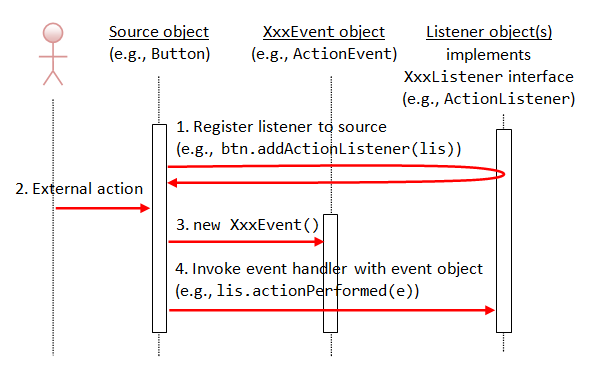

# Java GUI

## Desktop GUI applications

- AWT(Abstract Window Toolkit)
- Swing(Java Foundation Classes)
  - Pluggable Look and Feel
  - Platform Independent components
  - Enhanced component library
  
## Swing v.s. AWT
- AWT is a Java interface to native system GUI code present in your OS. It will not work the same on every system, although it tries.
- Swing is a more-or-less pure-Java GUI. It uses AWT to create an operating system window and then paints everything else on it.
- Thus Swing is 100% portable and is the same across platforms.
  
## AWT Packages

- java.awt 
	- GUI container classes
		- Frame
		- Panel
		- Dialog
		- ScrollPane
	- GUI component classes
		- Button
		- TextField
		- Label
	- Layout managers
		- BorderLayout (Positions), default for Frame
		- FlowLayout (Alignments), default for Panel / Applet
		- GridLayout
		- CardLayout, add panels/cards one behind the other
		- NullLayout, custom
	- Custom graphics classes
		- Graphics
		- Color
		- Font

- java.awt.event
	- Event classes
		- ActionEvent
		- MouseEvent
		- KeyEvent
		- WindowEvent
	- Event listener interfaces
		- ActionListener
		- MouseListener
		- KeyListener
		- WindowListener
	- Event listener adapter classes
		- MouseAdapter
		- KeyAdapter
		- WindowAdapter

### Container

Top Lever Containers

- Frame
- Dialog
- Applet

Secondary Containers

- Panel
- ScrollPane

### Frame

By default, frame's size is (0,0) and visibility is false;

```
f = new Frame();
f.setSize(500, 500);
f.setVisible(true);
```

### Event Handing
- Component (source/listener object)
	- Button
	- Label
	- List
	- Checkbox
	- Choice
	- TextField
- Event
- Listener

**Work Flow**

- create Source Object (e.g. create a button)
- create Listener Object (e.g. implement listener interface, override actionperformed method)
- register Listener to Source (e.g. button.addActionListener(l))
- wait for user to trigger the ActionListener -> (e.g. button create a new Event and invoke the actionperformend mehtod of the Lister Object)



notice: Listener interfaces are abstract, must override all methods; to avoid using interface, we can use(extends) the adapter (class)

## Example

code source from <https://www3.ntu.edu.sg/home/ehchua/programming/java/J4a_GUI.html>

~~~ java
import java.awt.*;       // Using AWT layouts
import java.awt.event.*; // Using AWT event classes and listener interfaces
import javax.swing.*;    // Using Swing components and containers

// A Swing GUI application inherits from top-level container javax.swing.JFrame
public class SwingCounter extends JFrame {   // JFrame instead of Frame
   private JTextField tfCount;  // Use Swing's JTextField instead of AWT's TextField
   private JButton btnCount;    // Using Swing's JButton instead of AWT's Button
   private int count = 0;
 
   // Constructor to setup the GUI components and event handlers
   public SwingCounter () {
      // Retrieve the content-pane of the top-level container JFrame
      // All operations done on the content-pane
      Container cp = getContentPane();
      cp.setLayout(new FlowLayout());
 
      cp.add(new JLabel("Counter"));
      tfCount = new JTextField("0", 10);
      tfCount.setEditable(false);
      cp.add(tfCount);
 
      btnCount = new JButton("Count");
      cp.add(btnCount);
 
      btnCount.addActionListener(new ActionListener() {
         @Override
         public void actionPerformed(ActionEvent evt) {
            ++count;
            tfCount.setText(count + "");
         }
      });
 
      setDefaultCloseOperation(JFrame.EXIT_ON_CLOSE);
      setTitle("Swing Counter");
      setSize(300, 100);
      setVisible(true);
   }
 
   public static void main(String[] args) {
      // Run the GUI construction in the Event-Dispatching thread for thread-safety
      SwingUtilities.invokeLater(new Runnable() {
         @Override
         public void run() {
            new SwingCounter(); // Let the constructor do the job
         }
      });
   }
}
~~~

## Links
- [Java Programming Tutorial(GUI)](https://www3.ntu.edu.sg/home/ehchua/programming/java/J4a_GUI.html)
