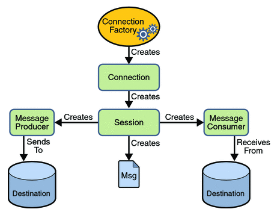

# Message Queue - JMS

MS (Java Message Service) is an API that provides the facility to create, 
send and read messages from one application to another.

## Advantage

- **Asynchronous**: To receive the message, client is not required to send request. Message will arrive automatically to the client.
- **Reliable**: It provides assurance that message is delivered.

## Usage

Example 1:

To process long-running operations asynchronously. 
A web user won't want to wait for more than 5 seconds for a request to process. 
If you have one that runs longer than that, one design is to submit the request to a queue and 
immediately send back a URL that the user can check to see when the job is finished.

Example 2:

To place an order for a particular customer. 
As part of placing that order (and storing it in a database) you may wish to carry a number of additional tasks:

- Store the order in some sort of third party back-end system (such as SAP).
- Send an email to the customer to inform them their order has been placed.

To do this your application code would publish a message onto a JMS queue which includes an order id. One part of your application listening to the queue may respond to the event by taking the orderId, looking the order up in the database and then place that order with another third party system. Another part of your application may be responsible for taking the orderId and sending a confirmation email to the customer.

<http://stackoverflow.com/questions/1035949/real-world-use-of-jms-message-queues>

## Messaging Domains

Point-to-Point (PTP) Messaging Domain: In PTP model, one message is delivered to one receiver only. 
Here, Queue is used as a message oriented middleware (MOM).

Publisher/Subscriber (Pub/Sub) Messaging Domain: In Pub/Sub model, one message is delivered to all the subscribers. 
It is like broadcasting. Here, Topic is used as a message oriented middleware that is responsible to hold and deliver messages.

## JMS Programming Model

## Links

- <http://www.javatpoint.com/jms-tutorial>
