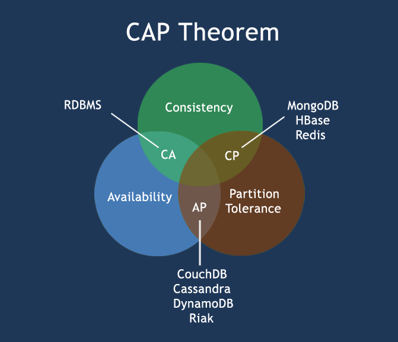

# NoSQL

## Types

Document Oriented
- Mongo DB
- Couch DB

Columnar
- Cassandra

Key-Value
- Redis
- Memcached

Graph
- Neo4j

## 优点/缺点

优点:
- 高可扩展性
- 分布式计算
- 低成本
- 架构的灵活性，半结构化数据
- 没有复杂的关系

缺点:
- 没有标准化
- 有限的查询功能（到目前为止）
- 最终一致是不直观的程序

## RDMBS v.s. NoSQL

- 数据类型：表 <-> 键值对存储，列存储，文档存储，图形数据库
- 存储结构：Structured (结构化的) <-> Structured  /Non-structured (非结构化的)
- 事务：Atomic Transaction (ACID) <-> Eventual Transaction (最终一致性)
- 扩展：Scale up <-> Scale out (横向扩展方便)
- 语法：PL/SQL <-> 没有声明性查询语言

## CAP定理

CAP定理，又被称作 布鲁尔定理（Brewer's theorem）, 它指出对于一个分布式计算系统来说，不可能同时满足以下三点:
- 一致性(Consistency) (所有节点在同一时间具有相同的数据)
- 可用性(Availability) (保证每个请求不管成功或者失败都有响应)
- 分隔容忍(Partition tolerance) (系统中任意信息的丢失或失败不会影响系统的继续运作)

CAP理论的核心是：一个分布式系统不可能同时很好的满足一致性，可用性和分区容错性这三个需求，最多只能同时较好的满足两个。
因此，根据 CAP 原理将 NoSQL 数据库分成了满足 CA 原则、满足 CP 原则和满足 AP 原则三 大类：
- CA - 单点集群，满足一致性，可用性的系统，通常在可扩展性上不太强大。
- CP - 满足一致性，分区容忍性的系统，通常性能不是特别高。
- AP - 满足可用性，分区容忍性的系统，通常可能对一致性要求低一些。

## Links
- <http://www.runoob.com/mongodb/nosql.html>
