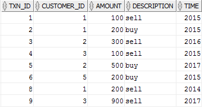

# SQL Query

## 几种题型的思路

单个表自身信息之间的关联和筛选
- where + and/or
- [not-boring-movies](https://leetcode.com/problems/not-boring-movies/description/)

两个表之间相互关联
- join
- [customers-who-never-order](https://leetcode.com/problems/customers-who-never-order/description/)

排序
- order by (limit offset)
- max/min
- [second-highest-salary](https://leetcode.com/problems/second-highest-salary/description/)

找出重复的
- join之后比较column value，可以找出所有包含重复项目的行
- group by having count()，只能找出那个重复的项目
- [duplicate-emails](https://leetcode.com/problems/duplicate-emails/description/)

## 几种结构的表

### 表中每行代表唯一信息的表

举例：

金融公司的一个Table：Customers，用来记录客户的基本信息，如下，
从逻辑层面来说，每条客户信息都是唯一的，代表了一个独立的客户。

~~~ sql
create table customers(
   id   int              not null,
   name varchar (20)     not null,
   age  int              not null,
   address  char (25) ,
   salary   decimal (18, 2),       
   primary key (id)
);

insert into customers (id,name,age,address,salary)
values (1, 'Ramesh', 32, 'Ahmedabad', 2000.00 );
insert into customers (id,name,age,address,salary)
values (2, 'Khilan', 25, 'Delhi', 1500.00 );
insert into customers (id,name,age,address,salary)
values (3, 'kaushik', 23, 'Kota', 2000.00 );
insert into customers (id,name,age,address,salary)
values (4, 'Chaitali', 25, 'Mumbai', 6500.00 );
insert into customers (id,name,age,address,salary)
values (5, 'Hardik', 27, 'Bhopal', 8500.00 );
insert into customers (id,name,age,address,salary)
values (6, 'Komal', 22, 'MP', 4500.00 );
insert into customers (id,name,age,address,salary)
values (7, 'Alice', 50, 'NYC', 4500.00 );
insert into customers (id,name,age,address,salary)
values (8, 'Bob', 50, 'NYC', 6000.00 );
insert into customers (id,name,age,address,salary)
values (9, 'Ramesh', 32, 'Ahmedabad', 2000.00 );

-- 求所有顾客的平均年龄
-- solution 1
select avg(age) from customers;
-- solution 2
select sum(age)/count(id) as average_age from customers;

-- 找出收入最高的顾客
select c1.name, c1.salary from customers c1
where c1.salary = (select max(c2.salary) from customers c2);

-- 找出收入第二高的顾客
select c1.name, c1.salary from customers c1
where c1.salary = (select salary from customers order by salary desc limit 1 offset 1);

-- 找出住址相同的顾客
select c1.name, c1.address from customers c1
inner join customers c2
on c1.name <> c2.name and c1.address = c2.address;

-- 找出有重复信息的顾客（除了ID不同，其它都相同的顾客）
select * from customers c1
inner join customers c2
on c1.id <> c2.id
and c1.name = c2.name
and c1.age = c2.age
and c1.address = c2.address
and c1.salary = c2.salary;
~~~

### 数据表中每行包含重复信息的表

举例：

Table TXN_DETAILS，这个用来记录所有交易记录

~~~ sql
create table txn_details(
   txn_id      int       not null,
   customer_id int       not null,
   amount      int       not null,
   description varchar (20)      ,
   time        int       not null,
   primary key (txn_id)
);

insert into txn_details (txn_id,customer_id,amount,description,time)
values (1, 1, 100, 'sell', 2015);
insert into txn_details (txn_id,customer_id,amount,description,time)
values (2, 1, 200, 'buy', 2015);
insert into txn_details (txn_id,customer_id,amount,description,time)
values (3, 2, 300, 'sell', 2016);
insert into txn_details (txn_id,customer_id,amount,description,time)
values (4, 3, 100, 'sell', 2015);
insert into txn_details (txn_id,customer_id,amount,description,time)
values (5, 2, 500, 'buy', 2017);
insert into txn_details (txn_id,customer_id,amount,description,time)
values (6, 5, 200, 'buy', 2015);
insert into tx8_details (txn_id,customer_id,amount,description,time)
values (7, 2, 300, 'sell', 2016);
insert into txn_details (txn_id,customer_id,amount,description,time)
values (8, 1, 200, 'sell', 2014);
insert into txn_details (txn_id,customer_id,amount,description,time)
values (9, 3, 900, 'sell', 2017);

-- 列出客户所有BUY交易数量的总和
select customer_id, sum(amount) from txn_details group by customer_id;

-- 列出在2016年之后有交易记录的客户
select distinct(customer_id) from txn_details where time >= 2016;

-- 列出在2016年之前没有交易记录的客户
-- solution 1: 最早的交易记录是发生在2016以后
select customer_id from txn_details
group by customer_id having min(time) >= 2016;
-- solution 2: 2016年之前有交易记录的客户的反面
select distinct(customer_id) from txn_details
where customer_id not in
(select customer_id from txn_details where time < 2016);
~~~
