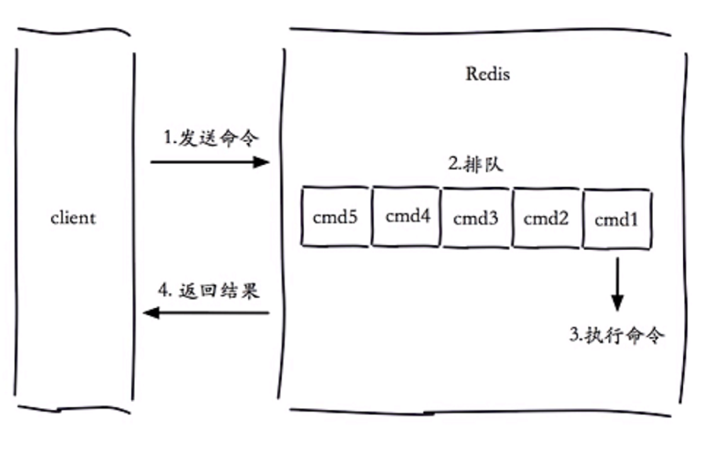

# Redis- Function

## 慢查询

### 生命周期

慢查询发生在第三阶段，执行命令。
客户端超时的原因有很多，不一定就是慢查询导致的。

### 两个配置

配置了慢查询之后，当一个命令执行时间超过某个值（`slowlog-log-slower-than`，比如10ms）时，就会被放入一个队列中（slowlog list），这个队列的长度为`slow-log-max-len`。
这是一个先进先出的队列，它是固定长度，存在内存中。

这里引出了两个重要配置参数：

`slow-log-max-len`
- 默认值：128，通常设置：1000

`slowlog-log-slower-than`
- 单位：微秒
- =0，记录所有命令；<0，不记录
- 默认值：10000（即10ms），通常设置：1ms

修改方式有两种，可以修改配置文件重启，也可以动态配置（推荐）

~~~
config set slowlog-max-len 1000
config set slowlog-log-slower-than 1000
~~~

三个命令

- `slowlog get[n]`：获取慢查询队列
- `slowlog len`：获取队列长度
- `slowlog reset`：清空

## pipeline

流水线的作用：将多条命令整合到一起，发送给redis server，减少网络开销。

举例：redis的命令时间是微妙级别。北京到上海光纤传输的理论时间是13毫秒。可以看出，一个命令发送一次，大部分的耗时都用在了网络传输中。

### Maven依赖

一般可以使用Jedis提供的pipeline功能，所以需要引入Jedis。

~~~
<!-- https://mvnrepository.com/artifact/redis.clients/jedis -->
<dependency>
    <groupId>redis.clients</groupId>
    <artifactId>jedis</artifactId>
    <version>2.9.0</version>
</dependency>
~~~

### 实战

~~~
Jedis jedis = new Jedis("127.0.0.1", 6379);
for (int i=0; i<100; i++) {
	Pipeline pipeline = jedis.pipelined();
	for (int j=i*100; j<(i+1)*100; j++) {
		pipeline.hset("hashkey:" + j, "field" + j, "value" + j);
	}
	pipeline.syncAndReturnAll();
}
~~~

### 注意点

- 每次pipeline携带数据数量，不能太大
- pipeline每次只能作用在一个redis节点上
- mset, mset是原子操作，pipeline不是原子操作

## 发布订阅

角色
- 发布者(publisher)
- 订阅者(subscriber)
- 频道(channel)

### 模型

注1：新加入的订阅者无法获取历史消息

注2：消息队列和发布订阅的区别，前者是多个listener抢消息，后者是每个listener都能获取到消息，适用于不同场景。

### 实战

~~~
publish [channel] [message]
publish sohu:tv "hello world"

// normal method
subscribe [channel]
unsubscribe [channel]

// by pattern
psubscribe [pattern]
punsubscribe [pattern]

// list channels with subscribers
pubsub channerls
// list num of subscribers for the channel
pubsub numsub [channel]
~~~

## bitmap

bitmap=位图，redis可以通过bitmap的API直接操作变量的二进制数，本质是字符串。

### 常用命令

~~~
getbit
setbit

bitop // and, or, xor 操作

bitcount // 获取指定范围值为1的个数
bitpos // 类似bitcount，计算指定范围值为1或者0的个数
~~~

### 实战

~~~
set hello big
-> OK
getbit hello 7
-> 0
setbit hello 7 1
-> 0
get hello
-> cig
~~~

### 案例分析

独立用户统计，使用set和bitmap对比
- set的话直接把用户IP都存在一个set中
- bitmap的话通过hash算法，把IP映射到一个数上，然后定位到位图中的某一个bit做修改，0就是没有，1就是有

1亿用户，5千万独立用户

如果是1亿用户，10万独立用户

- <https://cloud.tencent.com/developer/article/1550880>

## hyperloglog

### 作用

使用极小空间完成独立数量统计，本质是字符串。

但是，有两个缺陷：
- 因为是概率统计，给出的结果有微小的错误率
- 无法取得单条出局

### 命令

~~~
pfadd
pfcount
pfmerge
~~~

## geo

### 作用

存储经纬度

用途
- 计算两地距离
- 范围计算，如A地点范围内1km内的所有餐馆

注：geoKey的类型是zset

### 实战

~~~
// add
geoadd [key] [longitude] [latitude] [member]
geoadd cities:locations 116.28 39.55 beijing
geoadd cities:locations 117.12 39.08 tianjin

// get
geopos [key] [member]
geopos cities:locaitons tianjin

// distance
geodist

// radius
georadius
~~~
