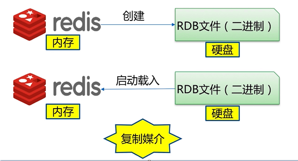
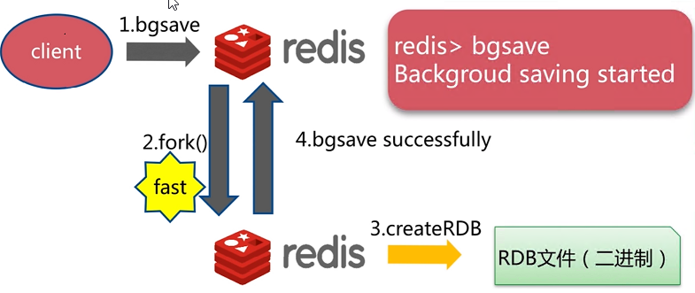
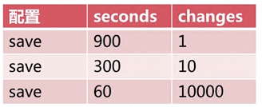
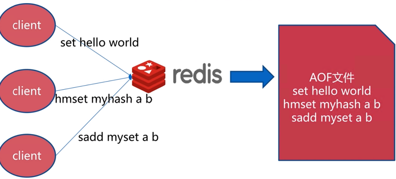
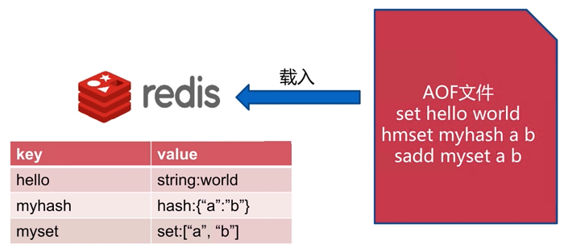
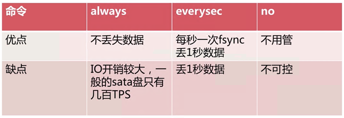
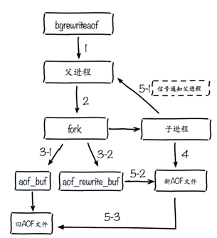

# Redis - Persistence

## 持久化的作用

Redis一般是将数据存在内容中的，但是断电的话就丢掉了，持久化可以把数据保存在磁盘中，从而可以断电恢复。

一般有两种持久化的方法
- RDB
- AOF

## RDB

什么是RDB，即存储一个数据的snapshot快照。

流程如下：

三种方式

- save （同步）
- bgsave （异步）
- 自动

### save

两个注意点：
- save如果文件过大，会阻塞。
- 文件策略是新的替换旧的。

### bgsave

流程如下：

需要注意的是：`fork()`一般非常快，但是极端情况可能会阻塞。

### 自动

本质是两步：
- 检测（变化是否达到临界值）
- （如果达到了，执行一个）bgsave

检查策略：（满足任意一个条件）

即如果60s内，发生了10000个修改，则做一次bgsave。
这里为什么这么设置呢？首先，短时间内(60s)，我们不希望频繁地自动保存，所以这个值要设大一些。然后，长时间内(900s)，我们也不希望硬盘和内存的数据差异太大，所以这个值要设置小一些。

默认配置和最佳配置

### 触发机制

- 全量复制
- debug reload
- shutdown (some cases)

### 潜在问题
- 耗时（依赖于Disk I/O的速度）
- 耗性能（fork操作消耗内存）
- 不可控，异步操作，宕机可能丢失数据

## AOF

AOF的原理其实是写日志。将每一条操作记录下来（先写到缓冲区中，再写到文件中），需要恢复时读取日志还原现场。

创建

恢复

### 三种策略

即什么时候将缓冲区中的内容保存(fsync)到文件中。

- always：每条指令都做一次fsync
- everysec（默认）：每秒做一次fsync
- no：由操作系统决定什么时候做fsync

比较

### 重写

AOF重写是将过期的，重复的，没有用的命令进行优化，重写。从而可以：
- 减少硬盘占用量
- 加快恢复速度

举例：increby1亿次，其实可以优化为set counter 1亿，大大节省空间和时间。

命令：`bgrewriteaof`

重写流程

重写rewrite配置

~~~
auto-aof-rewrite-min-size：尺寸（第一次重写时，文件需至少需要多大）
auto-aof-rewrite-percentage：增长率（再次重写时，文件需要比之前增长多少倍）
~~~

### 其它aof配置

~~~
appendonly yes
appendfilename "appendonly-${port}.aof"
appendfsync everysec
dir /bigdiskpath
no-appendfsync-on-rewrite yes
~~~

## RDD和AOF比较

RDB最佳策略
- "关"
- 集中管理
- 主从模式，从开

AOF最佳策略
- "开"
- 重写集中管理
- everysec

最佳策略
- 小分片
- 根据使用需求（缓存或存储）决定使用哪种策略
- 监控（硬盘，内存，负载，网络）
- 保证足够的内存
