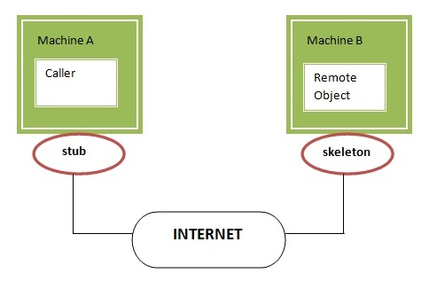

# RMI/RPC

Remote Mehtod Invokation

The RMI (Remote Method Invocation) is an API that provides a mechanism to create distributed application in java. 
The RMI **allows an object to invoke methods on an object running in another JVM**.

## Architecture


Stub
- It initiates a connection with remote Virtual Machine (JVM),
- It writes and transmits (marshals) the parameters to the remote Virtual Machine (JVM),
- It waits for the result
- It reads (unmarshals) the return value or exception, and
- It finally, returns the value to the caller.

Skeleton
- It reads the parameter for the remote method
- It invokes the method on the actual remote object, and
- It writes and transmits (marshals) the result to the caller.

Stub and Skeleton are encapsulated in the usage of RMI.

## Class

```
java.rmi
     |
  Remote
  Naming
```

```
java.rmi.server
     |
  UnicatRemoteObject
```

```
java.rmi.registry
     |
  Registry
     - bind()
     - rebind()
  LocateRegistry
     - createRegistry()
```

## Steps to Write RMI Program

- Create the **remote interface**
- Provide the **implementation of the remote interface**
- **Compile** the implementation class and create the stub and skeleton objects using the rmic tool
- Start the **registry service** by rmi registry tool
- Create and **start the remote application**
- Create and **start the client application**

Files ->
- remote interface
- remote implementation
- remote application
- client application

## Examples

remote interface

~~~ java
import java.rmi.*;

public interface MyRemote extends Remote {
	public String sayHello(String name) throws RemoteException;
}
~~~

remote implementation + remote application

~~~ java
import java.rmi.*;
import java.rmi.server.*;
import java.rmi.registry.*;

public class MyRemoteImpl extends UnicastRemoteOjbect implements MyRemote {
	public MyRemoteImpl() throws RemoteException {}

	public String sayHello(String name) {
		return "Hello " + name + " ...";
	}

	public static void main(String args[]) {
		//JNDI
		try {
		  Registry registry = LocateRegistry.createRegistry(5432);
		  MyRemoteImpl impl = new MyRemoteImpl();
		  registry.rebind("helloApp", impl);
		  System.out.println("App is running and waiting for clients...");
		} catch (Exception e) {
			e.printStackTrace();
		}
	}
}
~~~

client

~~~ java
import java.rmi.*;

class MyRemoteClient {
	public static void main(String args[]) {
		try {
			MyRemote myRemote = (MyRemote) Naming.lookup("rmi://172.17.30.162:5432/helloApp");
			String temp = myRemote.sayHello("Alice");
			System.out.println(temp);
		} catch(Exception e) {
			e.printStackTrace();
		}
	}
}
~~~

## RMI v.s. RPC

RMI = RPC + Object-orientation

- RPC is C based; It invokes a remote function / procedure.
- RMI is Java based; It invokes a remote method OR object.

<https://stackoverflow.com/questions/2728495/what-is-the-difference-between-java-rmi-and-rpc>

## Downside of RMI

RMI is not a good code practice because it introduces a lot of dependencies for the client. 
For a client, it does not care about the Java Object defined in another application. 
He should be able to simply say: this is what I want, and get that (or nothing) from server.

So in some cases (diving into legacy or "enterprise" applications) you just have no choice. You must use RMI. 
Or else REST + JSON over HTTP is a better choice.

<https://stackoverflow.com/questions/14326901/the-significance-of-java-rmi-please>

## Links
- <http://www.javatpoint.com/RMI>
