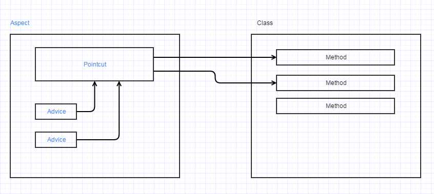

# Spring AOP

Aspect Oriented Programming (AOP, 面向切面编程) compliments OOPs in the sense that it also provides **modularity**. 
But the key unit of modularity is **aspect** than class.

## Why use AOP

利用AOP可以对业务逻辑的各个部分进行隔离，从而使得耦合度降低，提高程序的可重用性，便于对不同模块进行修改，也提高了开发效率。

## Where use AOP

- 日志记录
- 性能统计
- 安全控制
- 事务处理
- 异常处理

## AOP 原理

两种：
- 通过预编译方式
- 运行期动态代理

两者比较：
- AspectJ在编译时就增强了目标对象，Spring AOP的动态代理则是在每次运行时动态的增强，生成AOP代理对象。区别在于生成AOP代理对象的时机不同。
- 相对来说AspectJ的静态代理方式具有更好的性能，但是AspectJ需要特定的编译器进行处理，而Spring AOP则无需特定的编译器处理。

### 使用AspectJ在编译时修改class文件

原理：在编译阶段，在切面上，使用AOP代理类替换原有的类。

### 使用Spring AOP并采用动态代理的模式

- JDK动态代理：通过”接口”的方式实现动态代理
- CGLIB动态代理：通过”继承”的方式实现动态代理

## Spring AOP - API

- Cross-Cutting Concern
- Aspect：类似于Java的类声明，包含了pointcuts和advice
- Joint point：表示程序中的某个位置，比如方法调用，对类成员的访问等
- Pointcut：表示一组joint point，定义了advice将要发生的地方
- Advices：定义了具体要做的操作

### Cross-Cutting Concern

A concern that can affect the whole application and should be centralized in one location in code as possible, 
such as authentication, logging, security etc.

### Aspect

It is a class that contains advices, joinpoints etc.

~~~ java
@Aspect
public class TrackOperation{...}
~~~

### Join Point

Join Point is just a concept telling the program "at this point, I need some advices!" It does not have "Annotaion".

> Join point is any point in your program such as method execution, exception handling, field access etc. Spring supports only method execution join point.

### Pointcut

Pointcut tells the program to select some join points and apply advices

> It is an expression language of AOP that matches join points.

~~~ java
@Pointcut("execution(* Operation.*(..))")
public void myPointcut(){}//pointcut name
~~~

### Advices

Advice represents an action taken by an aspect at a particular join point. There are different types of advices:
- Before Advice: it executes before a join point.
- After Returning Advice: it executes after a joint point completes normally.
- After Throwing Advice: it executes if method exits by throwing an exception.
- After (finally) Advice: it executes after a join point regardless of join point exit whether normally or exceptional return.
- Around Advice: It executes before and after a join point.

``` java
    @Before("myPointcut()") //applying 'before advice' on this pointcut
    public void myadvice(JoinPoint jp) //it is the advice
    {
        System.out.println("additional concern");
        System.out.println("Method Signature: "  + jp.getSignature());
    }
```

## Spring AOP - in Action



step 1: choose a class/joint point that needs advice

~~~ java
public  class Operation{
    public int m(){System.out.println("m method invoked");return 1;}
    public int k(){System.out.println("k method invoked");return 2;}
}
~~~

step 2: write the Aspect class, telling **where** and **what**
- Pointcut: where to apply advices
- Advice: what to do

~~~ java
@Aspect
public class TrackOperation{
    @Pointcut("execution(* Operation.*(..))")
    public void myPointcut(){}

    @Before("myPointCut()")
    public void myadvice(JoinPoint jp)
    {
        System.out.println("additional concern");
    }
}
~~~

step 3: add beans in applicationContext.xml

~~~ java
<?xml version="1.0" encoding="UTF-8"?>
<beans xmlns="http://www.springframework.org/schema/beans"
    xmlns:xsi="http://www.w3.org/2001/XMLSchema-instance"
    xmlns:aop="http://www.springframework.org/schema/aop"
       xsi:schemaLocation="http://www.springframework.org/schema/beans
       http://www.springframework.org/schema/beans/spring-beans.xsd
       http://www.springframework.org/schema/aop
       http://www.springframework.org/schema/aop/spring-aop.xsd">

    <bean id="opBean" class="com.javatpoint.Operation"></bean>

    <bean id="trackMyBean" class="com.javatpoint.TrackOperation"></bean>
    <bean class="org.springframework.aop.aspectj.annotation.AnnotationAwareAspectJAutoProxyCreator"></bean>
</beans>
~~~

step 4: when use the "Operation" bean's method in the app, advices will be applied

## Links

- <http://www.javatpoint.com/spring-aop-aspectj-annotation-example>
- <http://www.mkyong.com/spring3/spring-aop-aspectj-annotation-example/>
- <http://www.importnew.com/24305.html>
- <http://blog.csdn.net/jeffleo/article/details/61205623>
