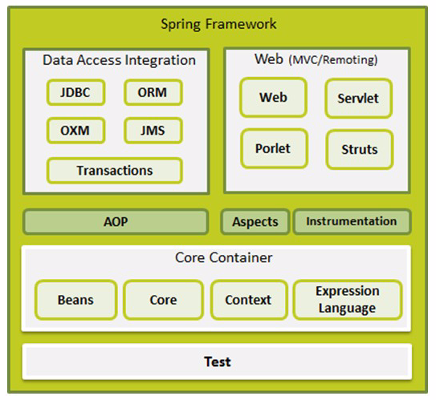

# Spring

## What is Sping Framework?

The Spring Framework is **an open source application framework** and **IoC** for the Java platform.

> Spring is modular, allowing you to pick and choose which modules are applicable to you, without having to bring in the rest.

### Sping Features

- D.I.
- Modular
- Spring MVC
- Spring AOP

### Sping Topics

- Spring Annotation
- Spring JPA
- Spring Security
- Spring / RESTful Integration
- Spring / SOAP Integration

## Sping Architecture

## Dependency Injection

### What is D.I.

> "One or more dependencies (or services) are injected, or passed by reference, into a dependent object (or client) and are made part of the client's state. The pattern separates the creation of a client's dependencies from its own behavior."

依赖注入模式，不是自己手动创建对象的实例，而是（统一）控制对象实例化的过程，然后传到需要用的地方。

### Three types of D.I.

[Wikipedia Link](http://en.wikipedia.org/wiki/Dependency_injection#Without_dependency_injection)

- Constructor injection
- Setter injection
- Interface injection

with Constructor Injection

~~~ java
Helper(Service service) {
    this.service = service;
}
~~~

with Setter Injection

~~~ java
public void setService(Service service) {
    this.service = service;
}
~~~

with Interface Injection

~~~ java
public interface ServiceSetter {
    public void setService(Service service);
}

public class Helper implements ServiceSetter {
    private Service service;

    @Override
    public void setService(Service service) {
        this.service = service;
    }
}
~~~

### D.I. Advantages

降低了依赖和被依赖类型间的耦合

如下例子中，在Helper类里调用了Service类来做一些事情，如果Service类的实现变了，改了constructor的signature，
那么Helper类也需要做改动，写的UT也要改动，等等。但是如果用了DI的话就没有这个问题。

~~~ java
// without dependency injection, we have to use `new()` to initiate the object
public class Helper {
    private ServiceExample service;
    Helper() {
        service = new ServiceExample(...);
    }
    public String doSomething() {
    	...
        service.doSomething();
	...
    }
}
~~~

### What is Spring D.I.

you do not create your objects but describe how they should be created (by configuration)

DI这个概念我们或多或少在平时写代码的时候早就运用了，只不过还是需要在程序某处用`new()`生成实例，然后传递到需要的地方。
Spring把这个单拿出来，在原有的基础上扩展了其功能。框架帮我们`new()`实例，我们只需要配置一下就好了。

The Spring IoC container will create the objects, wire them together, configure them, and manage their complete lifecycle from creation till destruction.

Types

- Spring ApplicationContext Container
  - create the bean before calling getBean()
- Spring BeanFactory Container
  - create the bean when calling getBean()

## Bean Factory/Application Context

### Creation of a bean ###

Two ways of create a bean factory and get bean

e.g. using BeanFactory

~~~ java
import org.springframework.beans.factory.BeanFactory;
import org.springframework.beans.factory.xml.XmlBeanFactory;
import org.springframework.core.io.FileSystemResource;

BeanFactory factory = new XmlBeanFactory(new FileSystemResource("spring.xml"));
Square square = (Square) factory.getBean("square");
~~~

e.g. using ApplicationContext

~~~ java
import org.springframework.context.ApplicationContext;
import org.springframework.context.support.ClassPathXmlApplicationContext;

ApplicationContext context = new ClassPathXmlApplicationContext("spring.xml");
Square square = (Square) context.getBean("square");
~~~

Difference between BeanFactory and ApplicaitonContext

- `BeanFactory` only instantiates bean when you call `getBean()` method
- `ApplicationContext` instantiates Singleton bean when container is started,  It doesn't wait for `getBean()` to be called

### Injecting Fields/Objects/Colleciton ###

Spring  using setter() to set class variables' values

**Fields**

e.g. Square.java

~~~ java
private int height;
~~~

e.g. spring.xml

~~~ xml
<bean id="square" class="com.chennanni.learnspring.Square">
     <property name="height" value="10"/>
</bean>
~~~

**Objects**

e.g. Square.java

~~~ java
private Point pointA;
~~~

e.g. spring.xml

~~~ xml
<bean id="square" class="com.chennanni.learnspring.Square">
	<property name="pointA">
		<bean class="com.chennanni.learnspring.Point">
			<property name="x" value="1" />
			<property name="y" value="1" />
		</bean>
	</property>
</bean>
~~~

**Collection**

~~~ xml
<bean id="triangle" class="com.chennanni.learnspring.Triangle">
	<property name="points">
		<list>
			<ref bean="Point1" />
			<ref bean="Point2" />
		</list>
	</property>
</bean>
~~~

### Using Constructor Injection ### 

Spring passes values to the constructor method

e.g. Square.java

~~~ java
private String type;
private int height;
private Square (String type, int height) {
	this.type = type;
	this.setHeight(height);
}
~~~

e.g. spring.xml:

~~~ xml
<bean id="square" class="com.chennanni.learnspring.Square">
	<constructor-arg type="java.lang.String" index="0" value="type1" />
	<constructor-arg type="int" index="1" value="10" />
	<property name="type" value="type2" />
</bean>
~~~

## Misc

### ContextLoaderListener

When to use it: if you want to put your Servlet file in your custom location or with custom name, rather than the default name `"[servlet-name]-servlet.xml"` and path under `"Web-INF/"`

~~~ xml
<context-param>
     <param-name>contextConfigLocation</param-name>
     <param-value>/MyLocation/myservlet-servlet.xml</param-value>
 </context-param>

<listener>
     <listener-class>org.springframework.web.context.ContextLoaderListener</listener-class>
</listener>
~~~

Purpose of `ContextLoaderListener`

- to tie the lifecycle of the `ApplicationContext` to the lifecycle of the `ServletContext`
- to automate the creation of the `ApplicationContext`

<http://stackoverflow.com/questions/11815339/role-purpose-of-contextloaderlistener-in-spring>

## Other Topic
- [[aop]]
- [[bean]]
- [[boot]]
- [[cloud]]
- [[spring/jms/jms]]
- [[spring/jpa/jpa]]
- [[spring/txn/txn]]

## Ref
- Spring全家桶：https://gitbook.cn/gitchat/column/5d2daffbb81adb3aa8cab878
