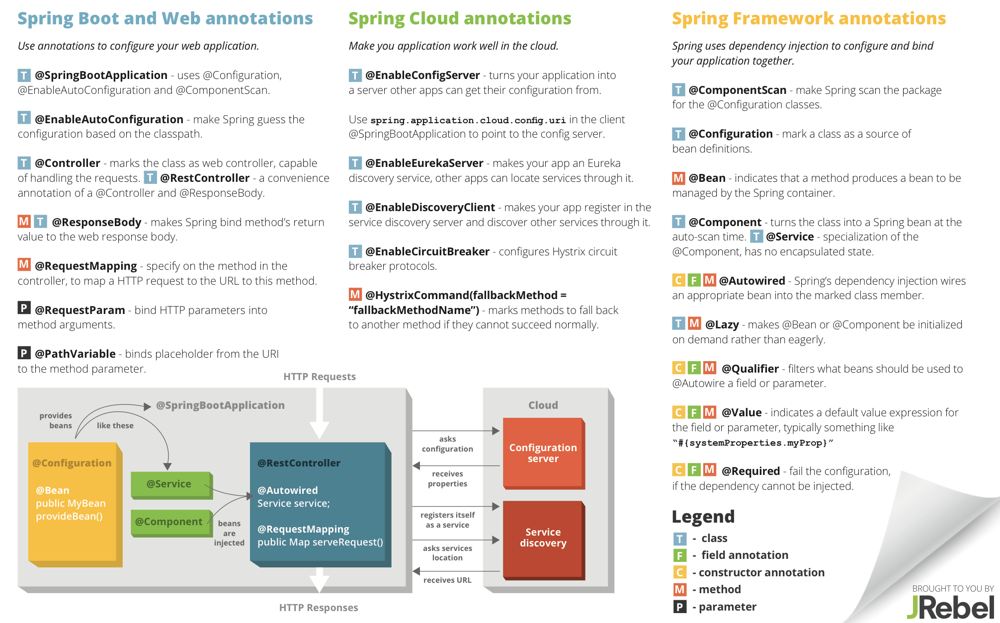

# Spring - Bean

> "A bean is an object that is instantiated, assembled, and otherwise managed by a Spring IoC container. 
These beans are created with the configuration metadata that you supply to the container, for example, in the form of XML definitions."

## Different types of Spring Beans

- Bean（万金油1，用于method）
- Component（万金油2，用于class）
- Configuration（配置）
- Service（服务）
- Controller（Web App控制层）
- Repository（DAO层）

## Properties

- class
- name
- scope
- constructor-arg
- properties
- autowiring mode
- lazy-inialization mode
- initialization method
- destruction method

## Inner Bean

Bean inside bean, object inside object

In the example, `PointA` is an inner bean of `square` referencing to `zeroPoint`. 
`PointB` is an inner bean defined inside `square`.

e.g. applicationContext.xml

~~~ xml
<bean id="square" class="com.chennanni.learnspring.Square">
	<property name="pointA" ref="zeroPoint" />
	<property name="pointB">
		<bean class="com.chennanni.learnspring.Point">
			<property name="x" value="1" />
			<property name="y" value="1" />
		</bean>
	</property>
</bean>

<bean id="zeroPoint" class="com.chennanni.learnspring.Point">
	<property name="x" value="0" />
	<property name="y" value="0" />
</bean>
~~~

## Bean Scope

### Basic

- singleton: a single instance per Spring IoC container (default)
  - container creates all beans when it is initialized, and then when an object called getBean(), container hands over the bean to the object
- prototyoe: new bean created with every request of reference
  - only when an object ask for the bean, container creates a bean and give it to the object

### Web-aware Context

- request: new bean per servlet request
- session: new bean per session
- global-session: new Bean per global HTTP session (portlet context)

### Syntax

~~~ xml
<bean ... scope="singleton">
     ...
</bean>
~~~

## Bean Autowiring

### When to use it

to autowire an inner bean

比如说有一个class `Person`，里面有一个inner class `Test`，
在做DI的时候，会把`Person`和`Test`都配置好，但是怎么把这两者关联起来呢？
这里就需要把`Test`wire到`Person`上。

- 具体的实现也有两种方式：Annotation和Configuration，
- 如何进行匹配也有两种方式：byName和byType。

~~~ java
class Person {
	int id;
	String name;
	
	@Autowired
	Test test;
}
~~~

### Annotation

Autowired on Properties

~~~ java
@Autowired
private Person person;
~~~

Autowired on Setter Methods

~~~ java
@Autowired
public void setPerson(Person person){
   this.person = person;
}
~~~

Autowired on Constructors

~~~ java
@Autowired
public Trip(Person person){
	this.person = person;
}
~~~

Autowired with (required=false) option

~~~ java
@Autowired(required=false)
~~~

if can not perform autowire for a property, set it to default value(null)

### Configuration

autowire = "byName": class variable' name is the same as the name of bean

~~~ xml
<bean ... autowire = "byName">
     ...
</bean>
~~~

autowiring = "byType": class variables' type is the same as the type of bean

~~~ xml
<bean ... autowire = "byType">
     ...
</bean>
~~~

autowire = "constructor": similar to byType, but type applies to constructor arguments

Note: in the constructor the bean needs to be initiated

~~~ xml
<bean ... autowire = "constructor">
     ...
</bean>
~~~

~~~ java
public class Foo {
	private Moo moo;
	public Foo(Moo moo) {
		this.moo = moo;
	}
}
~~~

## Bean Life Cycle

- Initialization
- Use
- Destruction
 
we can define what should be done after the bean is initialized/destroied

(Take initialization for example, destruction is just the same.)

Two Steps:

- register a shut down hook in the main app
- write the init method

### Register a shut down hook

~~~ java
AbstractApplicationContext context = new ClassPathXmlApplicationContext("Beans.xml");
context.registerShutdownHook();
~~~

### Write the init method

The first way: implement `InitializingBean` and overwrite its `afterPropertiesSet()`

~~~ java
public class ExampleBean implements InitializingBean {
   public void afterPropertiesSet() {
      // do some initialization work
   }
}
~~~

The second way(recommeded): specify the `init-method` attribute in the XML configuratoin file to map it to your own init method

~~~ java
<bean id="exampleBean"
         class="examples.ExampleBean" init-method="init"/>

public class ExampleBean {
   public void init() {
      // do some initialization work
   }
}
~~~

## Steps to Create and Use a Spring Bean

- create a bean class (pojo class)
- register and configue it in `application.xml` or using annotation
- get the bean using `applicationContext.getBean(...)` or `beanFactory.getBean(...)`
