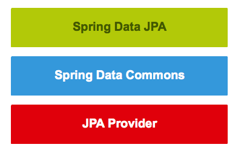

# Spring Data JPA

Spring Data JPA focuses on using JPA to store data in a relational database. 
Its most compelling feature is the ability to create repository implementations automatically, 
at runtime, from a repository interface.

Spring Data JPA is a library / framework that adds an extra layer of abstraction on the top of our JPA provider.



## Dependencies

- JDBC Driver
- Datasource (MySQL)
- JPA Provider (Hibernate)

## Configuration

`applicationContext.xml`

[Github spring-data-jpa-examples](https://github.com/pkainulainen/spring-data-jpa-examples/tree/master/query-methods/src/main/resources)

- DataSource
- entityManagerFactory
- transactionManager
- hibernateProperties

## CRUD Example

Create an interface that extends the `CrudRepository` interface

```
import org.springframework.data.repository.CrudRepository;
interface TodoRepository extends CrudRepository<TypeOfEntity, TypeOfEntityId> {
}
```

Create Query from Method Name

```
import org.springframework.data.jpa.repository.JpaRepository;

public interface PersonRepository extends JpaRepository<Person, Long> {
 
    /**
     * Finds persons by using the last name as a search criteria.
     * @param lastName  
     * @return  A list of persons which last name is an exact match with the given last name.
     *          If no persons is found, this method returns an empty list.
     */
    public List<Person> findByLastName(String lastName);
}
```

Using Created Query Methods

```
@Service
public class someServices() {
     @Resource
     private PersonRepository personRepository;
     public List<Person> search(String searchTerm) {
        return personRepository.findAll(lastNameIsLike(searchTerm));
    }
}
```

## Links

- [Spring Data JPA Tutorial](http://www.petrikainulainen.net/spring-data-jpa-tutorial/)
- [Spring Data JPA Reference](http://docs.spring.io/spring-data/jpa/docs/current/reference/html/)
- [Spring JPA Data + Hibernate + MySQL + Maven](http://www.javacodegeeks.com/2013/05/spring-jpa-data-hibernate-mysql-maven.html)
