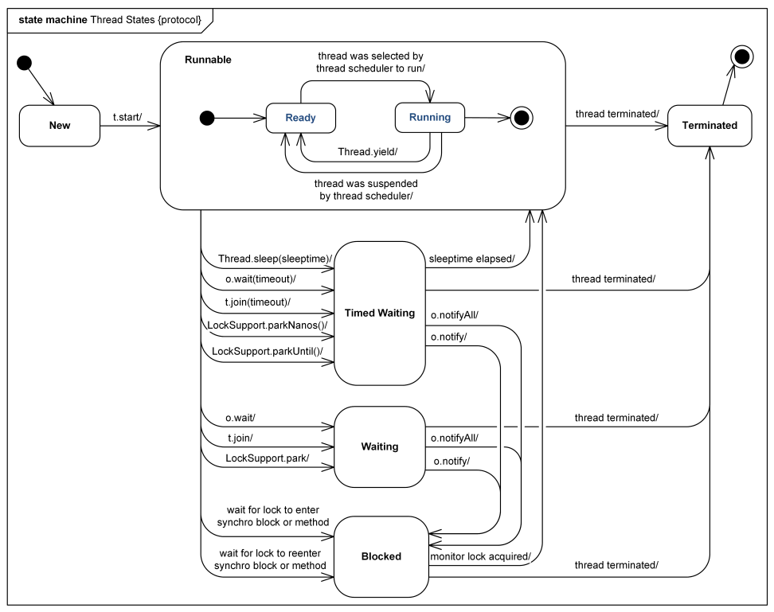

# Thread Basic

## Multi-Task: Parallelism v.s. Concurrency

让计算机在同一时间进行多项任务，一般有两种方式：并行(Parallelism)和并发(Concurrency)。

并行(Parallelism)：把一项任务拆分成可以同时执行的多个子任务，交给不同的运算单元去执行。
举例：大数据分析，TB级别的数据量，交给一个单核CPU来算，肯定很慢，那就换电脑，改成8核CPU，8个同时算就快了很多。如果还嫌慢，那就加电脑，10台8核CPU电脑，也就是80个CPU，速度又提高了不少。（当然算完了肯定要合并结果，这是Map Reduce的内容以后另说）

**并行就是，客服中心有8个电话，公司雇了8个员工，每人分1个电话。**


并发(Concurrency)：通过CPU调度算法，同一时间内运行多个进程/线程，在各个程序之间来回切换执行。
为什么会有并发？为什么要来回倒腾？一个活干完了再干下一个活不行吗？真不行，比如我们一边写博客，一边听歌，一边下载电影，同时运行了三个程序。
如果没有并发，只能开一个程序，用户体验就差很多。而且关键是，这三个任务其实占用的CPU，内存都不高，只有最后一个下电影，对网速和硬盘读写有较大的要求，计算机完全可忙得过来。

**并发就是，客服中心有8个电话，公司雇了1个超级员工，让他1个人接8个电话，不断换着讲。**


## Concurrency - Benefits and Costs

并发是为了程序运行得更快。启用多个线程，并互相切换，可以减少因某个线程阻塞而等待的时间。
但是，由于上下文切换也有开销，所以并不是一定并发比串行要快。

用Lmbench3测量上下文切换时长，用vmstat测量上下文切换次数。

## Concurrency Implementation: Process v.s. Thread

说说Concurrency，一般实现有两种手段：多线程（Thread）和多进程(Process)。

Thread v.s. Process

- A Process usually contains multiple threads at the same time.
- Threads (of the same process) run in a shared memory space, while processes run in separate memory spaces.

多进程(Process)很好理解，Windows打开任务管理器可以看到多个正在执行的进程。
这里主要谈多线程（Thread），因为它更容易编程实现，效率更高。

## Thread: Benefits and Costs

Benefit
- better resource utilization 资源利用率高
- more responsive design 系统更高的响应率

Cost
- more complex design 设计复杂度增加
- context switching overhead 线程切换负担
- issues when not thread safe 未保证多线程安全的情况下可能会带来问题

## Java Thread State

线程的状态：
- new
- runnable
  - ready
  - running
- waiting
  - timed waiting
  - waiting
- blocked
- terminated

注：有的地方把 waiting 和 blocked 都看作是阻塞，需要注意。



总结：

- 正常运行的线程：
  - 创建 -> `new` state
  - start() -> `runnable - ready` state
  - 被scheduler排到了，获取CPU资源 -> `running` state
  - 运行完 -> `terminated` state
- sleep（作用于本线程，自己"睡"若干时间）：
  - `sleep(timeout)` -> `timed waiting` state
  - timeout完了之后 -> `runnable` state
- wait：（作用于某个Object，我等这个Obj，直到它通知我好了，我才会继续往下走）
  - `obj.wait(timeout)` -> `timed waiting` state
  - timeout完了之后 -> 相当于进入了`waiting` state，等待`obj.notify()`
  - `obj.notify()` -> `block` state，waiting for the monitor lock to enter/re-enter a synchronized block/method
  - 获取monitor lock -> `runnable` state
- join：（作用于某个Thread，我等这个Thread终结，才会继续往下走）
  - `t.join(timeout)` -> `timed waiting` state
  - timeout完了之后 -> 相当于进入了`waiting` state
  - 等待的那个thread终结了之后 -> `runnable` state

经常问到的几个问题：

- `sleep()`和`wait()`有什么区别：
  - 都可以用来放弃CPU一定的时间，不同点在于如果线程持有某个对象的监视器moniter，`sleep()`不会放弃这个对象的监视器，`wait()`会放弃这个对象的监视器
  - `sleep()`完了之后就进入`Runnable`状态
  - `wait()`完之后还在`Blocked`状态，要等待获取monitor lock
- 线程中断`interrupt`了怎么做可以让它继续运行：
  - catch住`InterruptedException`，然后决定是否要中止程序，或者让它继续运行下去
- `start()`和`run()`有什么区别：
  - `start()`**不堵塞**；它call了`run()`，完了程序就继续执行下去了，不会等待线程运行返回结果
  - `run()`会堵塞等待；它开始执行线程内容，会等线程运行完毕才继续执行下面的内容
- `Runnable`接口和`Callable`接口的区别：
  - `Runnable`接口中的`run()`方法的**返回值**是`void`，它做的事情只是纯粹地去执行`run()`方法中的代码而已
  - `Callable`接口中的`call()`方法是有返回值的，是一个泛型，和`Future`, `FutureTask`配合可以用来获取异步执行的结果，或者当等待时间太长时取消任务
- 如何在两个线程之间共享数据：
  - 通过在线程之间共享**对象**就可以了，比方说阻塞队列`BlockingQueue`就是为线程之间共享数据而设计的。

## Java Thread Interrupt

线程中断

当一个线程调用`interrupt()`后，表示告诉当前线程：你把手中的活停一下，可能要干些别的事了。如下：

~~~ java
public static void main(String[] args) throws InterruptedException {  
    ThreadA t = new ThreadA();  
    t.start();  
    Thread.sleep(3000);  
    t.interrupt();  
}
~~~

这个时候，当前线程干了一件事：把`Thread.currentThread().isInterrupted()`的值置为true。然后，就看当前线程怎么处理这个flag了。

1. 一种可能，编程者检查了这个flag，然后使用一段其它的处理逻辑。
2. 另一种可能，编程者检查了这个flag，然后抛出一个`InterruptedException`。（比如`Thread.sleep()`, `Object.wait()`, `Thread.join()`都会这么干，并且将flag复位）
3. 还有一种，编程者直接忽略掉这个flag，那一切无事发生。

下例，是第1种情况：

~~~ java
public class ThreadA extends Thread{
    public void run(){
        while(true){
            if(Thread.currentThread().isInterrupted()){  
                System.out.println("Someone interrupted me.");
                return;
            }
            else{
                System.out.println("Thread is Going...");  
            }
        }
    }
}
~~~

下例，是第2种情况：需要注意的是，`InterruptedException`是由`sleep(100)`抛出的。

~~~ java
    public void run() {
        while (true) {
            try {
                sleep(100);
                System.out.println("Thread is Going...");
            } catch (InterruptedException e) {
                //e.printStackTrace();
                System.out.println("Someone interrupted me. I can't sleep.");
                return;
            }
        }
    }
~~~

中断使用场景：

1. 在某线程中，调用了`Thread.sleep(10000)`等10s，实际发现不需要10s，于是使用中断提前唤醒。
2. 线程A调用`join()`方法等待线程B执行结束，但是线程B发现自己短时间无法结束，于是使用中断，告诉线程A别等我了。

参考 -> 理解java线程的中断 <https://blog.csdn.net/canot/article/details/51087772> 和 <https://docs.oracle.com/javase/tutorial/essential/concurrency/interrupt.html>

## Java Thread Example

创建线程对象的方式
- 继承`Thread`类
- 实现`Runnable`接口
- 实现`Callable`接口

创建线程的方式
- 单个线程 `Thread`
- 线程池 `Executors`

Thread Programming Steps:

- create (thread) objects with thread features (**implement Runnable / implement Callable / extends Thread**)
  - override `run()`
  - (optional) override `start()` ; usually the thread instantiation happens here
- create a thread with (thread objects)
  - call `Thread.start()` or `Executors.submit()`

e.g.

~~~ java
 // Part 1: extends Thread
 class PrimeThread extends Thread {
     long minPrime;
     PrimeThread(long minPrime) {
         this.minPrime = minPrime;
     }
     public void run() {
         // compute primes larger than minPrime
         ...
     }
 }
 ...
 PrimeThread p = new PrimeThread(143);
 p.start();

 // Part 2: implements Runnable
 class PrimeRun implements Runnable {
     long minPrime;
     PrimeRun(long minPrime) {
         this.minPrime = minPrime;
     }
     public void run() {
         // compute primes larger than minPrime
         ...
     }
 }
 ...
 PrimeRun p = new PrimeRun(143);
 new Thread(p).start();
 
 // Part 3: using Executors
 ExecutorService executor = Executors.newSingleThreadExecutor();
 executor.submit(() -> {
     String threadName = Thread.currentThread().getName();
     System.out.println("Hello " + threadName);
 });
~~~

## Thread Issues

多线程共享内存空间，即Thread之间资源共享，一个Thread可以access到另一个Thread的资源，这里就可能会出问题。

- **Race Condition**竞争: Race condition occurs when multiple threads update shared resources. 两个线程同时要更新一个资源，你先来还是我先来？谁都不相让，自然要打起来。
- **Deadlock**死锁: Two or more threads are blocked forever, waiting for each other.

e.g. 两个线程同时对String和int进行大量（1000次）操作，预期的结果是：count=1000，string存放了0-999。
但是由于非线程安全，线程1，2同时操作变量，有一个的结果就被“丢掉”了。

~~~ java
public class ConcurrencyIssueTest {
    String string = "";
    int count = 0;

    void inc() {
        string += (","+count++);
    }

    public static void main(String args[]) throws Exception {
        ConcurrencyIssueTest test = new ConcurrencyIssueTest();
        ExecutorService executor = Executors.newFixedThreadPool(2);
        IntStream.range(0, 1000).forEach(i -> executor.submit(test::inc));

        executor.shutdown();
        executor.awaitTermination(60, TimeUnit.SECONDS);

        System.out.println(test.count);
        System.out.println(test.string);
    }
}
~~~

输出如下：

~~~
999
...277,279,281,283,285,287...
~~~

为了防止出现这些问题，需要在设计开发的时候特别注意，保证Thread Safe。

## Thread Safe

Thread safety: The program state (fields/objects/variables) behaves correctly when multiple simultaneous threads are using a resource. 保证一个资源同时被多个进程读写时表现正常。

那么如何实现（资源的）Thread Safe呢？

- 隔离（自己玩自己的，互不干扰）use a pattern whereby each thread context is isolated from others
  - 局部变量
  - for example, `ThreadLocal` class
- 加锁（同一时刻，只有一个人可以修改），restrict access to a resource to a single thread at a time
  - for example, `synchronized` keyword (monitor/intrinsic lock)
  - for example, `ReentrantLock`
  - `java.util.concurrent.ConcurrentHashMap` (lock on segment)
- CAS（如果修改，从头再来，避免加锁开销），适合并发量不高的情况
  - `java.util.concurrent.atomic` (CAS compare-and-swap)
  - `java.util.concurrent.BlockingQueue`
  - `Semaphores` (CAS -> AQS AbstractQueuedSynchronizer)

- [https://www.cnblogs.com/lixinjie/p/a-answer-about-thread-safety-in-a-interview.html](https://www.cnblogs.com/lixinjie/p/a-answer-about-thread-safety-in-a-interview.html)

## Synchronization

同步，实现的手法是加 Multual Exclusive 互斥锁。

- 是可重入的。
- 是映射到操作系统级别的操作，是一个重量级锁。

synchronized关键字加在不同地方，效果也不同，[这里](https://github.com/pzxwhc/MineKnowContainer/issues/7) 总结得很好：

- 类
  - 修饰一个类，作用的对象是这个类的所有对象
  - 修改一个静态的方法（相当于修饰了一个类），作用的对象是这个方法所属于的类的所有对象
- 方法
  - 修饰一个方法，作用的对象是**调用**这个方法的对象
  - 修饰一个代码块（相当于修饰了一个匿名方法），作用的对象是**调用**这个代码块的对象

e.g. synchronized class

~~~ java
class ClassName {
  public void method() {
    synchronized(ClassName.class) {
      // todo
    }
  }
}
~~~

e.g. synchronized method

~~~ java
public synchronized void method() {
  // todo
}
~~~

那么到底同步方法有什么用呢？-> <https://docs.oracle.com/javase/tutorial/essential/concurrency/syncmeth.html>

## Deadlock Prevention

**Lock Ordering**: make sure that all locks are always taken in the same order by any thread

```
典型反面例子

Thread 1:
    lock A
    wait B

Thread 2:
    lock B
    wait A
```

**Lock Timeout**: if a thread does not succeed in taking all necessary locks within the given timeout, it will backup, free all locks taken, wait for a random amount of time and then retry.

**Deadlock Detection**: every time a thread takes a lock it is noted in a data structure (map, graph etc.) of threads and locks. Additionally, whenever a thread requests a lock this is also noted in this data structure.

When a thread requests a lock but the request is denied, the thread can traverse the lock graph to check for deadlocks.


Tools:
- jstack
- alibaba arthas
- jconsole / jvisualvm

## Links
- [Java Concurrency / Multithreading Tutorial](http://tutorials.jenkov.com/java-concurrency/index.html)
- [40个Java多线程问题总结](http://www.cnblogs.com/xrq730/p/5060921.html)
- [Java中的多线程你只要看这一篇就够了](http://www.importnew.com/21089.html)
- [What-does-the-term-thread-safe-mean-in-Java](https://www.quora.com/What-does-the-term-thread-safe-mean-in-Java)
- [Synchronization and Locks](https://winterbe.com/posts/2015/04/30/java8-concurrency-tutorial-synchronized-locks-examples/)
