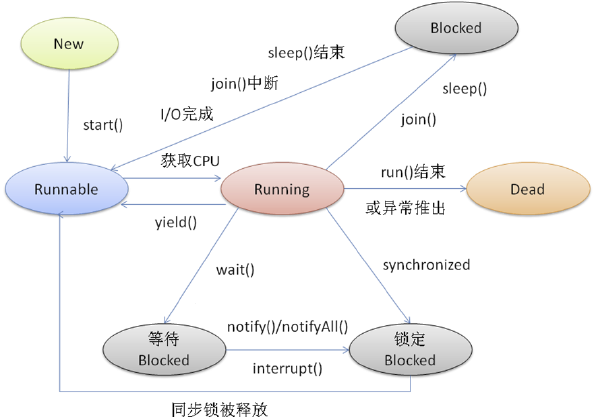

# Thread Basic

## Parallelism v.s. Concurrency

让计算机在同一时间进行多项任务，一般有两种方式：并行(Parallelism)和并发(Concurrency)。

并行(Parallelism)：把一项任务拆分成可以同时执行的多个子任务，交给不同的运算单元去执行。
举例：大数据分析，TB级别的数据量，交给一个单核CPU来算，肯定很慢，那就换电脑，改成8核CPU，8个同时算就快了很多。如果还嫌慢，那就加电脑，10台8核CPU电脑，也就是80个CPU，速度又提高了不少。（当然算完了肯定要合并结果，这是Map Reduce的内容以后另说）


并发(Concurrency)：通过CPU调度算法，同一时间内运行多个进程/线程，在各个程序之间来回切换执行。
为什么会有并发？为什么要来回倒腾？一个活干完了再干下一个活不行吗？真不行，比如我们一边写博客，一边听歌，一边下载电影，同时运行了三个程序。
如果没有并发，只能开一个程序，用户体验就差很多。而且关键是，这三个任务其实占用的CPU，内存都不高，只有最后一个下电影，对网速和硬盘读写有较大的要求，计算机完全可忙得过来。


## Process v.s. Thread

说说Concurrency，一般实现有两种手段：多线程（Thread）和多进程(Process)。

Thread v.s. Process

- A Process usually contains multiple threads at the same time.
- Threads (of the same process) run in a shared memory space, while processes run in separate memory spaces.

这里主要谈多线程（Thread），因为它更容易编程实现，效率更高。

## Benefits and Costs of Multi-Threading

Benefit
- better resource utilization 资源利用率高
- more responsive design 系统更高的响应率

Cost
- more complex design 设计复杂度增加
- context switching overhead 线程切换负担
- increase resource assumption 资源必须是多线程安全的
- issues with multi-threading 未保证多线程安全的情况下可能会带来问题

## Thread State

线程的五个状态：
- New
- Runnable
- Running
- Blocked
- Dead



经常问到的几个问题：

- sleep()和wait()有什么区别：
  - 都可以用来放弃CPU一定的时间，不同点在于如果线程持有某个对象的监视器moniter，sleep()不会放弃这个对象的监视器，wait()会放弃这个对象的监视器，所以sleep完了之后就进入Runnable状态，而wait完之后还在Blocked状态
- 线程中断了怎么做可以让它继续运行：
- start()和run()有什么区别：
  - start()里面call了run()，完了程序就继续执行下去了，不会等待线程运行返回结果
  - run()开始执行线程内容，会等线程运行完毕才继续执行下面的内容
- Runnable接口和Callable接口的区别：
  - Runnable接口中的run()方法的返回值是void，它做的事情只是纯粹地去执行run()方法中的代码而已
  - Callable接口中的call()方法是有返回值的，是一个泛型，和Future、FutureTask配合可以用来获取异步执行的结果，或者当等待时间太长时取消任务
- 如何在两个线程之间共享数据：
  - 通过在线程之间共享对象就可以了，比方说阻塞队列BlockingQueue就是为线程之间共享数据而设计的。

## Java Thread Example

创建线程的方式
- 继承`Thread`类
- 实现`Runnable`接口

Steps:

- create a thread object
  - create some object with thread features (**implement Runnable / extends Thread**)
  - create a thread object
- define the function of the thread
  - override `run()`
  - (optional) override `start()` ; usually the thread instantiation happens here
- start the thread
  - call `start()`

e.g.

```
// Part 1
Class SomeClass implements Runnable { // or extends Thread
     private Thread t;
     public void run() {...}
     public void start() {
          if (t == null) {
               t = new Thread(this, "threadName");
               t.start();
          }
     }
}
...
{
     SomeClass example = new SomeClass(...);
     example.start();
}

// Part 2: using anonymous class
Thread t=new Thread(){  
  public void run(){  
       obj.method();  
  }  
};
```

## Problems with Multi-threading

多线程共享内存空间，即Thread之间资源共享，一个Thread可以access到另一个Thread的资源，这里就可能会出问题。

- **Race Condition**竞争: Race condition occurs when multiple threads update shared resources. 两个线程同时要更新一个资源，你先来还是我先来？谁都不相让，自然要打起来。
- **Deadlock**死锁: Two or more threads are blocked forever, waiting for each other. 

为了防止出现这些问题，需要在设计开发的时候特别注意，保证Thread Safe。

- **Thread safety**: A piece of code is thread-safe if it only manipulates shared data structures in a manner that guarantees safe execution by multiple threads at the same time.

那么如何实现Thread Safe呢？
- ？？？

## Synchronization

Problem: thread interference and memory consistency errors

Lock: Every object has an lock associated with it. By convention, a thread that needs consistent access to an object's fields has to acquire the object's lock before accessing them, and then release the lock when it's done with them.

Synchronization

 - Process Synchronization
 - Thread Synchronization

Multual Exclusive

 - by synchronized method
 - by synchronized block
 - by static synchronization

e.g. usage

```
synchronized method() {...}
synchronized (object reference expression) {...} ; 
//Notice: in this case, the object's all fields are not available
```

## Deadlock Prevention

**Lock Ordering**: make sure that all locks are always taken in the same order by any thread

```
Situation:
	Thread 1:
	  lock A
	  lock B
	Thread 2:
	   wait for A
	   lock C (when A locked)
	Thread 3:
	   wait for A
	   wait for B
	   wait for C

Solve:
	Neither Thread 2 or Thread 3 can lock C until they have locked A first.
```

**Lock Timeout**: if a thread does not succeed in taking all necessary locks within the given timeout, it will backup, free all locks taken, wait for a random amount of time and then retry.

**Deadlock Detection**: every time a thread takes a lock it is noted in a data structure (map, graph etc.) of threads and locks. Additionally, whenever a thread requests a lock this is also noted in this data structure.

When a thread requests a lock but the request is denied, the thread can traverse the lock graph to check for deadlocks.


Tools: jps, jconsole, jstack, JMX API

## Misc

Daemon Thread
- Daemon thread in java is a service provider thread that provides services to the user thread. Its life depend on the mercy of user threads i.e. when all the user threads dies, JVM terminates this thread automatically.
- There are many java daemon threads running automatically, e.g. gc, finalizer etc.

Gargage Collection
- `finalize()`: The finalize method is called when an object is about to get garbage collected. That can be at any time after it has become eligible for garbage collection.

Immutability: immutable object is thread-safe, but the use/reference of it may not be.

fail-fast v.s. fail-safe: http://blog.csdn.net/chenssy/article/details/38151189

## Links
- [Java Concurrency / Multithreading Tutorial](http://tutorials.jenkov.com/java-concurrency/index.html)
- [40个Java多线程问题总结](http://www.cnblogs.com/xrq730/p/5060921.html) 
