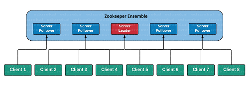

# Zookeeper - Basic

## 概述

Zookeeper是**分布式协调系统**（可以理解为像是一个分布式的nginx）。

~~~
Client   <->   Zookeeper（集群）  <->   Hadoop集群（Master + Slave）
~~~

- Client发出一个query，到了Zookeeper，Zookeeper负责将这个request"转发"到后端的某一个Master或者Slave上。（功能上类似nginx）
- 同时，为了避免单点故障，Zookeeper本身也是集群部署的。（这里的关键是，把集群内数据同步的时间压缩得更短）

-> 为什么需要 Zookeeper <https://zhuanlan.zhihu.com/p/69114539>

## CAP

分布式系统有三个指标：

- Consistency 一致性
  - 数据在多个副本之间是否能够保持一致的特性。
- Availability 可用性
  - 系统提供的服务必须一直处于可用状态，对每一个操作的请求必须在有限时间内返回结果。
- Partition tolerance 分区容错性
  - 分布式系统在遇到网络分区故障时，仍然需要保证对外提供一致性和可用性的服务，除非整个网络都发生故障。

Eric Brewer 说，这三个指标不可能同时做到。这个结论就叫做 CAP 定理。

分区容错（P）可以认为总是成立，因为从设计上来说一般都是3个copy，即使1-2个挂了集群仍然能工作。
基于此，CAP的主要矛盾是一致性（C）和可用性（A）的矛盾。
- 如果要保证一致性，就要锁住集群，等待写操作完成，就没有可用性了。
- 如果要保证可用性，就不能锁住集群，就没有一致性了。

现在大部分公司的选择是，优先保证可用性 AP ，然后保证最终一致性 CP 。

参考 -> CAP 定理的含义 <http://www.ruanyifeng.com/blog/2018/07/cap.html>

## 安装

### 下载

~~~
wget https://downloads.apache.org/zookeeper/stable/apache-zookeeper-3.5.8-bin.tar.gz
~~~

### 解压

`tar -xvf apache-zookeeper-3.5.8.tar.gz `

### 配置

`/conf/zoo.cfg`

~~~
# 是一个计时单位，两秒钟一个计时单位。
tickTime=2000 
# 启动的时候 leader 与 foolwer 之间连接最大的心跳数，有多少个计时单位，10 个就是 10 乘以 2000，也就是 20 秒，
# 如果超过了这个时间则连接失败，如果在设定的时间段内，半数以上的跟随者未能完成同步，领导者便会宣布放弃领导地位，
# 进行另一次的领导选举。如果 zk 集群环境数量确实很大，同步数据的时间会变长，因此这种情况下可以适当调大该参数。默认为 10。
initLimit=10 
# follower 服务器与 leader 服务器之间 请求和应答之间能容忍的最多心跳数，有多少个计时单位，默认为 5*2=10 秒。
syncLimit=5 
# zookeeper 在硬盘上存储数据和命名 zk 服务器 id 的地方。
dataDir=/usr/local/zookeeperData 
# 客户端端口是 2181，也就是程序连接 zk 向外暴漏的端口是 2181。
clientport=2181 

# 2888 代表 zk 服务器集群之间的通信端口号
# 3888 代表 zk 集群之间进行 leader 选举的端口号
server.1=192.168.56.102:2888:3888
server.2=192.168.56.103:2888:3888
server.3=192.168.56.104:2888:3888
~~~

`/usr/local/zookeeperData/myid`

~~~
1
# 第 1 台（192.168.56.102）设置为 1
# 第 2 台（192.168.56.103）设置为 2
# 第 3 台（192.168.56.104）设置为 3
~~~

### 运行

启动服务器：`/bin/zkServer.sh start`

~~~
> jps
QuorumPeerMain
~~~

启动客户端：`/bin/zkCli.sh`

查看状态：`/bin/zkServer.sh status`

如果单机的话，就是 standalone 模式
如果集群的话，就有 leader + follower 。

~~~
ZooKeeper JMX enabled by default
Using config: /root/zookeeper/apache-zookeeper-3.5.8-bin/bin/../conf/zoo.cfg
Client port found: 2181. Client address: localhost.
Mode: standalone
~~~

## 节点类型

持久化节点：`create /node_name ['node_value']`

持久化顺序节点：`create -s /node_name`

临时节点：`create -e /node_name`

临时顺序节点：`create -s -e /node_name`

最终，组合起来所有节点就像一颗树一样，如下：

## 常用命令

操作起来就像文件系统一样。

~~~
ls /
ls /node_name
get /node_name
set /node_name node_value
delete /node_name
~~~

## 权限控制

操作权限

- CREATE - `c`
- READ - `r`
- WRITE - `w`
- DELETE - `d`
- ADMIN - `a`

（注：这 5 种权限中， DELETE 是指对子节点的删除权限，其它 4 种权限指对自身节点的操作权限。）

身份认证

- `world`：默认方式
- `auth`：代表已经认证通过的用户(cli 中可以通过 `addauth digest user:pwd` 来添加当前上下文中的授权用户)
- `digest`：即用户名:密码这种方式认证，这也是业务系统中最常用的
- `ip`

使用

~~~
getAcl /myNode1
setAcl /myNode1 world:anyone:rda
~~~

## 读写流程

写：

- Client 向 Server1 发送写请求。
- 如果 Server1 是 Follower ，会把请求转发给 Leader 。
- Leader 把写请求广播通知所有其它 Follower 。
- Leader 和 Follower 各自写数据。 Follwer 写数据成功后，通知 Leader 。
- Leader 收到半数以上的节点成功的消息后，说明写操作成功。 Leader 通知最初接受写请求的 Server1 。
- Server1 向 Client 发送消息，告知写操作成功。

读：

- Client 访问哪一个 Server ，哪一个 Server 直接返回结果。

## ZAB 协议

ZAB 协议是为 ZooKeeper 专门设计的一种**支持崩溃恢复**的一致性协议。
基于该协议， ZooKeeper 实现了一种主从模式的系统架构来保持集群中各个副本之间的数据一致性。

ZAB 协议分为两种模式：

- 崩溃恢复模式：当服务启动或 leader 服务器崩溃退出与重启，会进入崩溃恢复模式，然后选举 leader 服务器，当 leader 被选举出来后，且集群中有过半的机器完成与 leader 服务器的状态同步，就会退出恢复模式。
- 消息广播模式：当集群中有过半的 follower 完成 与 leader 的状态同步，就进入消息广播模式。当有新的 server 加入到 zookeeper 服务中，会以恢复模式启动，找到 leader 服务器，完成状态同步，然后一起参与到消息广播模式。

## 编程实战

添加依赖

~~~ xml
<dependency>
	<groupId>org.apache.zookeeper</groupId>
	<artifactId>zookeeper</artifactId>
	<version>3.5.5</version>
</dependency>
~~~

简单的应用，连接到ZK服务器上，创建节点，查看节点数据，修改节点数据

~~~ java
import java.util.Date;
import java.util.List;
import java.util.concurrent.CountDownLatch;

import org.apache.zookeeper.CreateMode;
import org.apache.zookeeper.WatchedEvent;
import org.apache.zookeeper.Watcher;
import org.apache.zookeeper.Watcher.Event.KeeperState;
import org.apache.zookeeper.ZooDefs.Ids;
import org.apache.zookeeper.ZooKeeper;
import org.apache.zookeeper.data.Stat;

public class ZkConnect {
    private ZooKeeper zk;
    private CountDownLatch connSignal = new CountDownLatch(0);
    
    public ZooKeeper connect(String host) throws Exception {
        zk = new ZooKeeper(host, 3000, new Watcher() {
            public void process(WatchedEvent event) {
                if (event.getState() == KeeperState.SyncConnected) {
                    connSignal.countDown();
                }
            }
        });
        connSignal.await();
        return zk;
    }

    public void close() throws InterruptedException {
        zk.close();
    }

    public void createNode(String path, byte[] data) throws Exception
    {
        zk.create(path, data, Ids.OPEN_ACL_UNSAFE, CreateMode.PERSISTENT);
    }

    public void updateNode(String path, byte[] data) throws Exception
    {
        zk.setData(path, data, zk.exists(path, true).getVersion());
    }

    public void deleteNode(String path) throws Exception
    {
        zk.delete(path,  zk.exists(path, true).getVersion());
    }

    public static void main (String args[]) throws Exception
    {
        ZkConnect connector = new ZkConnect();
        ZooKeeper zk = connector.connect("aliyun");

        // delete if existing
        String newNode = "/myTestNode" + new Date().getTime();
        Stat stat = zk.exists(newNode, false);
        if (stat != null) {
            System.out.println("0. Delete existing node: " + newNode);
            connector.deleteNode(newNode);
        }
        // create node
        connector.createNode(newNode, "test data 1".getBytes());
        System.out.println("1. Create node: " + newNode);

        // get all nodes
        System.out.println("2. Get all nodes...");
        List<String> zNodes = zk.getChildren("/", true);
        for (String zNode: zNodes)
        {
            System.out.println("### ChildrenNode: " + zNode);
        }

        // get node data
        byte[] data = zk.getData(newNode, true, zk.exists(newNode, true));
        System.out.print("3. Get node data: ");
        for ( byte dataPoint : data)
        {
            System.out.print ((char)dataPoint);
        }
        System.out.print("\n");

        // change node data
        connector.updateNode(newNode, "test data 2".getBytes());
        data = zk.getData(newNode, true, zk.exists(newNode, true));
        System.out.print("4. Modify node data: ");
        for ( byte dataPoint : data)
        {
            System.out.print ((char)dataPoint);
        }
        System.out.print("\n");
    }

}
~~~

结果 ->

~~~
1. Create node: /myTestNode1604716130278
2. Get all nodes...
### ChildrenNode: myTestNode1604716130278
### ChildrenNode: zookeeper
3. Get node data: test data 1
4. Modify node data: test data 2
~~~

## 参考

- <https://gitbook.cn/books/5ef47a1690c794640abd37d4/index.html>
- <https://stackoverflow.com/questions/33524537/good-zookeeper-hello-world-program-with-java-client>
